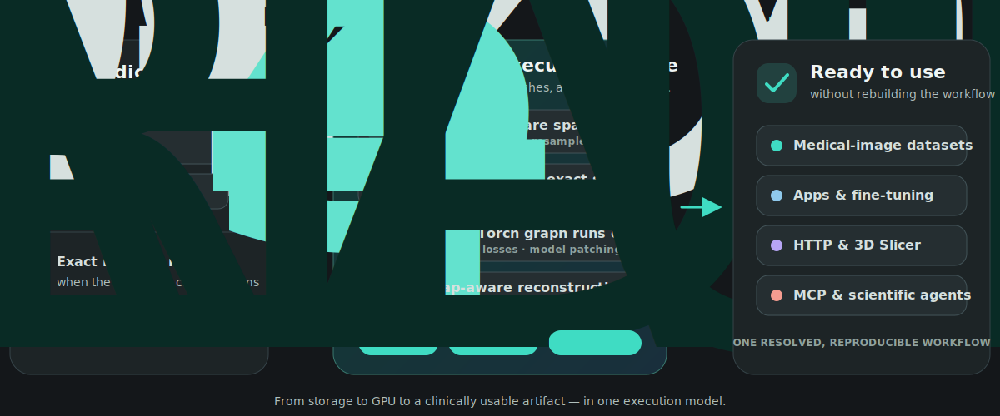

<div align="center">
  
  <h1>Medical-imaging workflows, executable end to end</h1>
  <p><strong>From images on disk to reproducible experiments, production inference, and reusable clinical applications.</strong></p>
  <p>
    <a href="https://pypi.org/project/konfai/"></a>
    <a href="https://www.python.org/"></a>
    <a href="https://github.com/vboussot/KonfAI/actions/workflows/konfai_ci.yml"></a>
    <a href="https://konfai.readthedocs.io/en/latest/"></a>
    <a href="https://github.com/vboussot/KonfAI/blob/main/LICENSE"></a>
  </p>
  <p>
    <a href="https://konfai.readthedocs.io/en/latest/quickstart.html"><strong>Quickstart</strong></a>
    · <a href="https://konfai.readthedocs.io/en/latest/examples/visual-gallery.html"><strong>See it on real data</strong></a>
    · <a href="https://konfai.readthedocs.io/en/latest/usage/large-images.html"><strong>Large images</strong></a>
    · <a href="https://konfai.readthedocs.io/en/latest/usage/adopting-konfai.html"><strong>Bring PyTorch or MONAI</strong></a>
    · <a href="https://konfai.readthedocs.io/en/latest/usage/apps.html"><strong>Ship an App</strong></a>
    · <a href="https://konfai.readthedocs.io/en/latest/usage/mcp.html"><strong>Automate with MCP</strong></a>
  </p>
</div>

---

**KonfAI is a declarative medical-imaging execution engine.** It turns a
reproducible research workflow into patch-native training, complete
medical-image inference, and a reusable application—without giving up the
PyTorch and MONAI components you already trust.

One configuration model connects storage, transforms, model graphs, losses,
training, prediction, evaluation, and output geometry. The resolved YAML is the
experiment record: inspectable, diffable, and runnable by a researcher or an
agent.

```yaml
Trainer:
  Model:
    classpath: UNet.yml          # a model, referenced by name
  Dataset:
    groups_src: { CT: {...}, SEG: {...} }   # channel-first, lazy, patch-based
  epochs: 100
```

```bash
konfai TRAIN -c Config.yml --gpu 0     # then PREDICTION, then EVALUATION
```

<p align="center">
  <picture>
    <source media="(max-width: 640px)" srcset="docs/source/_static/readme/execution-flow-mobile.svg" width="720" height="1330" />
    
  </picture>
</p>

KonfAI has powered **top-ranking MICCAI-challenge results** across segmentation,
registration, and synthesis:
[SynthRAD2025 T1](https://github.com/vboussot/Synthrad2025_Task_1) ·
[SynthRAD2025 T2](https://github.com/vboussot/Synthrad2025_Task_2) ·
[CURVAS PDACVI](https://github.com/vboussot/CurvasPDACVI) ·
[TrackRAD2025](https://github.com/vboussot/TrackRAD2025) ·
[Panther](https://github.com/vboussot/Panther) ·
[CURVAS](https://github.com/vboussot/CURVAS)

> 📄 **Paper:** [KonfAI: A Modular and Fully Configurable Framework for Deep Learning in Medical Imaging](https://www.arxiv.org/abs/2508.09823) (Boussot & Dillenseger, 2025)

> 🤖 **Agent-operable.** KonfAI ships an **[MCP server](https://konfai.readthedocs.io/en/latest/usage/mcp.html)**
> so an LLM agent can drive the *entire* experiment loop — inspect a dataset, author & validate YAML,
> launch train / predict / evaluate, monitor jobs, and compare runs — always grounded in the same
> reproducible configs a human would run. → **[Agents & MCP](https://konfai.readthedocs.io/en/latest/usage/mcp.html)**

---

## Why KonfAI?

- **Scale.** Dataset patches can be read regionally from ITK, HDF5, DICOM, and
  OME-Zarr when preprocessing is stream-compatible; a bounded buffer preserves
  correctness when it is not. Prediction owns batching, TTA, ensembles,
  reductions, overlap reconstruction, geometry, and output writing.
- **Reproduce.** Training, prediction, and evaluation share named datasets and
  inspectable model graphs. Defaults are materialised into the YAML and configs
  travel with run artifacts.
- **Ship and automate.** Package the stable workflow as a local, Hugging Face,
  or remote App, use it from 3D Slicer, or let an MCP client operate the same
  validated builders and workspaces.

Already use another stack? Keep it. KonfAI can instantiate regular PyTorch and
MONAI components, and its catalog includes documented compatibility paths for
selected MONAI, nnU-Net, torchvision, and segmentation-models-pytorch models.
[See when to use KonfAI—or another tool.](https://konfai.readthedocs.io/en/latest/usage/adopting-konfai.html)

## One engine owns the complete medical workflow

| Layer | What KonfAI makes executable |
| --- | --- |
| **Storage and data** | Cases, modality groups, geometry, regional reads, transforms, cache/buffer policy, dataset patches |
| **Learning** | Named model graph, intermediate supervision, losses, metrics, optimizer, schedules, dataset- and model-level patching |
| **Inference** | Checkpoints, patch batches, TTA, ensembles, reductions, overlap blending, inverse transforms, medical-image outputs |
| **Evidence** | Resolved configs, checkpoints, statistics, predictions, per-case and aggregate evaluation JSON |
| **Delivery** | Local/Hugging Face Apps, HTTP jobs, external 3D Slicer client, uncertainty, evaluation, fine-tuning |
| **Automation** | Dataset inspection, config validation, smoke tests, jobs, metrics, run comparison through MCP |

That vertical integration is the product. YAML is its durable, inspectable
interface—not the value proposition by itself.

## Real workloads, one App contract

The same App interface already ships full segmentation, synthesis and
registration systems—not reduced demonstration networks:

| App | Workload | Published RTX PRO 5000 benchmark |
| --- | --- | --- |
| **TotalSegmentator-KonfAI** | CT: 117 labels / 5 models · MRI: 50 labels / 2 models | **CT `total`: ≈42 s / ≈20 GB VRAM / ≈19 GB RAM** vs ≈76 s for the original |
| **MRSegmentator-KonfAI** | MRI: 40 labels, 5-fold ensemble | **≈27 s / ≈22 GB VRAM / ≈2 GB RAM** vs ≈35 s / ≈11 GB RAM for the original |
| **ImpactSynth** | four MR/CBCT→sCT variants, 2.5D UNet++, 5 models each | ≈24 s / ≈16 GB VRAM for the benchmark inference; ≈82 s full ensemble; ≈2 GB RAM |
| **ImpactSeg** | one model segments 11 structures from CT, MRI, or CBCT | ≈7 s / ≈10 GB VRAM / ≈1.6 GB RAM |
| **IMPACT-Reg** | 13 multimodal presets across elastix+IMPACT, ConvexAdam, and FireANTs | `ConvexAdam_Composite`: ≈5.1 s / ≈2.1 GB VRAM |

These figures retain each bundle's stated case, ensemble and hardware
conditions; they are evidence of executable scale, not a cross-task
leaderboard. The bundles share the same App contract across local directories,
Hugging Face and HTTP, with SlicerKonfAI for general Apps and SlicerImpactReg
for dedicated registration.

Consuming a published workflow does **not** require authoring YAML. Install its
task-specific CLI and run one command, or address the same bundle through
`konfai-apps`; the complete configuration remains available when you need to
inspect, evaluate, fine-tune, or automate it.

```bash
pip install impact_synth_konfai
impact-synth-konfai synthesize MR -i input_mr.nii.gz -o output/

# The same packaged workflow through the generic App runtime
konfai-apps infer VBoussot/ImpactSynth:MR -i input_mr.nii.gz -o output/
```

---

## Install

```bash
pip install "konfai[imaging]"     # core + all imaging backends (recommended)
pip install konfai                # core only (bring your own data reader)
```

`[imaging]` pulls SimpleITK / h5py / pydicom / zarr — needed to read `.mha`,
`.nii.gz`, DICOM, and OME-Zarr. For the full extras matrix (`ssim`, `fid`,
`lpips`, `export`, `cluster`, …) and a reproducible Pixi setup, see the
[installation guide](https://konfai.readthedocs.io/en/latest/getting-started/installation.html).

---

## Three workflows, three configs

KonfAI is command-driven; each CLI state maps to one YAML file:

| Command | Config | Does |
| --- | --- | --- |
| `konfai TRAIN` / `RESUME` | `Config.yml` (`Trainer:`) | fit a model |
| `konfai PREDICTION` | `Prediction.yml` (`Predictor:`) | patch/TTA/ensemble inference → datasets |
| `konfai EVALUATION` | `Evaluation.yml` (`Evaluator:`) | metrics on saved predictions |

Full CLI reference (flags, `konfai-cluster`, `konfai-apps`):
[docs/reference/cli](https://konfai.readthedocs.io/en/latest/reference/cli.html).

---

## Quickstart (first smoke run)

```bash
git clone https://github.com/vboussot/KonfAI.git && cd KonfAI
pip install -e ".[imaging]"
cd examples/Segmentation

# download the small public demo dataset
pip install -U "huggingface_hub[cli]"
hf download VBoussot/konfai-demo --repo-type dataset --include "Segmentation/**" --local-dir Dataset
mv Dataset/Segmentation/* Dataset/ && rmdir Dataset/Segmentation && rm -rf Dataset/.cache

# For a short smoke run, first set `epochs: 1` in Config.yml.
konfai TRAIN -y --gpu 0 --config Config.yml     # use --cpu 1 if you have no GPU
```

> 💡 After a run, `Config.yml` will contain the resolved defaults KonfAI
> materialised — that's expected, and it's what makes runs reproducible.

Runtime depends on dataset size, hardware, and whether you keep the shipped
100-epoch setting. The one-epoch edit checks the complete path quickly; it is
not intended to produce a useful checkpoint.

The full walkthrough (predict, evaluate, what to inspect, common first issues,
notebook entry points) lives in the
[**Quickstart**](https://konfai.readthedocs.io/en/latest/quickstart.html).

---

## 🩻 How volumes are read

Volumes are read as patches. Whether the volume is *also* held in RAM depends on
`use_cache` and on whether your preprocessing chain can be streamed — KonfAI
derives streamability from the transforms you declared:

| Regime | When | Memory held |
| --- | --- | --- |
| **Cache** | `use_cache: true` (training default) | every case, resident for the whole run |
| **Stream** | `use_cache: false`, chain is streamable | one patch |
| **Buffer** | `use_cache: false`, chain is not streamable | a FIFO of `max(batch_size + 1, shuffle_window)` cases |

A chain streams when every step declares the region it needs: the exact patch
(`OneHot`), a halo (`Dilate`), a remap (`Flip`), a resample (`ResampleToShape`),
or a whole-volume statistic read once from disk (`Normalize`). On the stream
path, a 16 GiB uncompressed `.mha` trains at patch 64³ under an 8 GiB memory cap
with a peak resident set of 0.46 GiB.

→ [**Patch streaming**](https://konfai.readthedocs.io/en/latest/concepts/streaming.html) — what streams, what does not, and why.

---

## What's in the box

Everything below is referenceable by name in YAML. See the
[**built-in component catalogue**](https://konfai.readthedocs.io/en/latest/reference/components/index.html)
for classpaths and constructor arguments.

| Kind | Examples | Catalogue |
| --- | --- | --- |
| **Models** | `UNet`, `NestedUNet`, `ResNet`, `VAE`, `VoxelMorph`, GAN/diffusion families | [models](https://konfai.readthedocs.io/en/latest/reference/components/models.html) |
| **Losses & metrics** | `Dice`, `MAE`, `PSNR`, `SSIM`, `LPIPS`, `FID`, `CrossEntropyLoss`, `TRE`, `IMPACTReg`, `IMPACTSynth` | [losses-metrics](https://konfai.readthedocs.io/en/latest/reference/components/losses-metrics.html) |
| **Transforms** | `Standardize`, `Normalize`, `Clip`, `Resample*`, `OneHot`, `Crop` (~40) | [transforms](https://konfai.readthedocs.io/en/latest/reference/components/transforms.html) |
| **Augmentations** | `Flip`, `Rotate`, `Elastix`, `Noise`, `CutOUT` (~15) | [augmentations](https://konfai.readthedocs.io/en/latest/reference/components/augmentations.html) |
| **Schedulers** | weight (`Constant`, `CosineAnnealing`) + LR (`PolyLRScheduler`, `Warmup`, any torch) | [schedulers](https://konfai.readthedocs.io/en/latest/reference/components/schedulers.html) |
| **Storage backends** | ITK, HDF5, DICOM series, OME-Zarr | [storage-backends](https://konfai.readthedocs.io/en/latest/reference/components/storage-backends.html) |

Not limited to these: any importable class (`monai.losses:DiceLoss`,
`torch:nn:L1Loss`, or a local `Model:MyNet`) works via the `module:Class` form.

---

## 🤖 Agent-ready by design

KonfAI is built to serve as a **deterministic backend for LLM-driven
experimentation**. Through the **KonfAI-MCP server**, an agent can:

- 🔎 inspect datasets and infer their structure
- 📝 generate and validate YAML configurations
- 🚀 launch training / prediction / evaluation runs
- 📈 read live metrics, compare runs, and iterate

Every execution stays **reproducible, structured, and grounded in the same YAML
workflows** a human would run — bridging LLM reasoning and real experimental
execution. See the [ecosystem map](https://konfai.readthedocs.io/en/latest/ecosystem/index.html)
for the current status.

---

## Ecosystem

| Package | What it is |
| --- | --- |
| **`konfai`** | the core framework (this repo) |
| **`konfai-apps`** | package a workflow as an app — [CLI](https://konfai.readthedocs.io/en/latest/reference/cli.html), [HTTP server](https://konfai.readthedocs.io/en/latest/reference/app-server-api.html), [Python API](https://konfai.readthedocs.io/en/latest/reference/python-api.html) |
| **App bundles** (`apps/`) | ready-to-run: `impact-synth`, `impact-seg`, `mrsegmentator`, `totalsegmentator`, `impact-reg` |
| **[SlicerKonfAI](https://github.com/vboussot/SlicerKonfAI)** | run segmentation, synthesis, evaluation, and uncertainty Apps from 3D Slicer |
| **[SlicerImpactReg](https://github.com/vboussot/SlicerImpactReg)** | run IMPACT-Reg presets and inspect registration results in 3D Slicer |
| **KonfAI-MCP** | expose KonfAI to LLM agents — inspect data, author configs, launch and monitor runs |

See the [ecosystem map](https://konfai.readthedocs.io/en/latest/ecosystem/index.html)
for what is shipped vs. in-progress.

---

## Documentation

📚 **Full docs: <https://konfai.readthedocs.io/en/latest/>**

- [Quickstart](https://konfai.readthedocs.io/en/latest/quickstart.html) — first end-to-end run
- [Core concepts](https://konfai.readthedocs.io/en/latest/concepts/index.html) — how YAML becomes Python objects
- [Large images](https://konfai.readthedocs.io/en/latest/usage/large-images.html) — regional reads, fallback, and tuning
- [Adopt from PyTorch/MONAI](https://konfai.readthedocs.io/en/latest/usage/adopting-konfai.html) — reuse and tool choice
- [Component catalogue](https://konfai.readthedocs.io/en/latest/reference/components/index.html) — everything you can configure
- [Examples](https://konfai.readthedocs.io/en/latest/examples/index.html) — runnable Segmentation & Synthesis workflows

🐳 **Docker:** `vboussot/konfai` —
[guide](https://konfai.readthedocs.io/en/latest/usage/docker.html).

---

## Development & contributing

```bash
git clone https://github.com/vboussot/KonfAI.git && cd KonfAI
pixi install
pixi run test      # run the test suite
pixi run check     # lint + format-check + test (run before pushing)
```

Contributions are welcome — improve examples, clarify docs, add tests, or extend
models / transforms / apps. See the
[developer guide](https://konfai.readthedocs.io/en/latest/development.html).

**AI coding agents:** start with [`AGENTS.md`](AGENTS.md) — the canonical
reference for conventions, commands, and repository rules.

---

## Citation

```bibtex
@article{boussot2025konfai,
  title   = {KonfAI: A Modular and Fully Configurable Framework for Deep Learning in Medical Imaging},
  author  = {Boussot, Valentin and Dillenseger, Jean-Louis},
  journal = {arXiv preprint arXiv:2508.09823},
  year    = {2025}
}
```

Licensed under [Apache-2.0](LICENSE).
