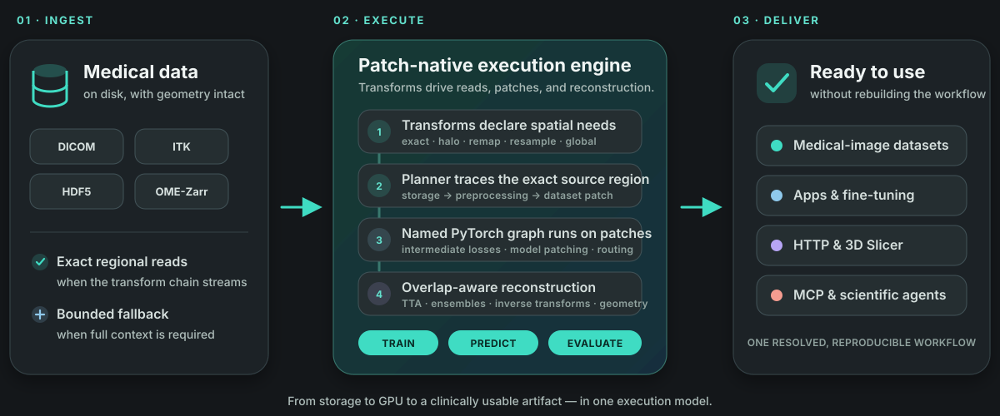
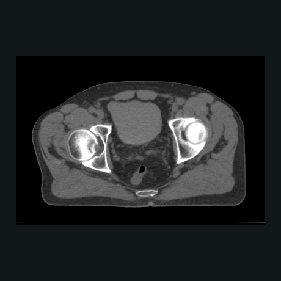
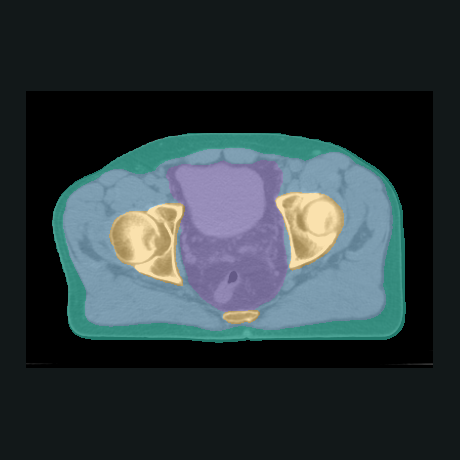
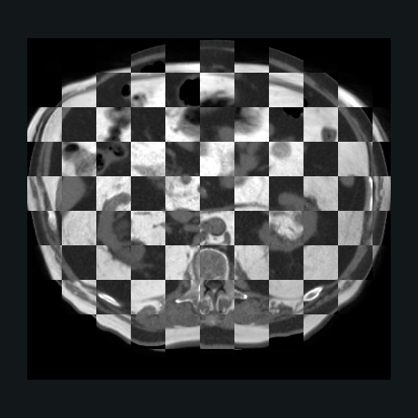
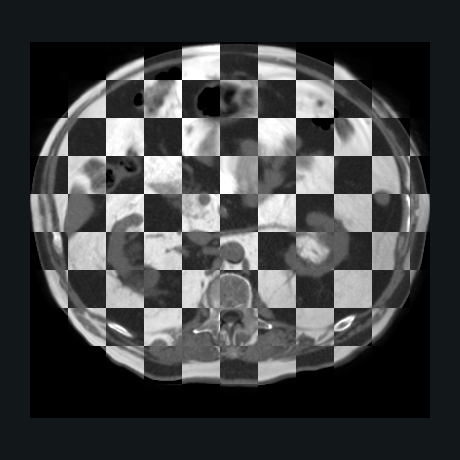

# Examples

Every example under `examples/` is a notebook you open and run top to bottom. It
fetches its own data, runs the real `konfai` commands, and ends by showing the
result, from a fresh environment, Google Colab included.

**Five run a published model**: no training, no YAML, a real result in about a
minute. Start there to see what KonfAI produces before learning how it is
configured. They are KonfAI {doc}`Apps <../usage/apps>`.

| Run a published model | Task | |
| --- | --- | --- |
| `TotalSegmentator` | whole-body CT segmentation, 117 labels | [](https://colab.research.google.com/github/fideus-labs/KonfAI/blob/main/examples/TotalSegmentator/TotalSegmentator_demo.ipynb) |
| `MRSegmentator` | multi-organ MR segmentation, 40 labels | [](https://colab.research.google.com/github/fideus-labs/KonfAI/blob/main/examples/MRSegmentator/MRSegmentator_demo.ipynb) |
| `ImpactSeg` | one model, 11 structures from CT, MR or CBCT | [](https://colab.research.google.com/github/fideus-labs/KonfAI/blob/main/examples/ImpactSeg/ImpactSeg_demo.ipynb) |
| `ImpactSynth` | synthetic CT from MR or CBCT | [](https://colab.research.google.com/github/fideus-labs/KonfAI/blob/main/examples/ImpactSynth/ImpactSynth_demo.ipynb) |
| `ImpactReg` | register two *different* patients, scored on their reference labels | [](https://colab.research.google.com/github/fideus-labs/KonfAI/blob/main/examples/ImpactReg/register_demo.ipynb) |

**The other three are the framework itself**: a YAML config, the `konfai` CLI,
and nothing else. They are what you copy for your own experiment, and the pages
below document them. Their training runs are deliberately short, so the scores
demonstrate the pipeline rather than the method. A fourth,
[Bring your model](#bring-your-model), is the same engine without the YAML: a MONAI `UNet`
trained and run through `konfai.train_model` and `konfai.predict_model`.

Both tiers use the public demo data on Hugging Face: `VBoussot/konfai-demo` ships
a `Segmentation/` subset (pelvis CT, 41-label reference: also the source
`Registration` deforms into fixed/moving pairs) and a `Synthesis/` subset (paired
MR / CT / body mask).

<figure class="kf-visual kf-visual--execution">
  <a class="kf-visual-frame" href="../_static/readme/execution-flow.svg" aria-label="Open the KonfAI execution-flow diagram at full resolution">
    <picture>
      <source media="(max-width: 640px)" srcset="../_static/readme/execution-flow-mobile.svg" width="720" height="1330">
      
    </picture>
  </a>
  <figcaption>
    <span class="kf-visual-copy">
      <strong>The shared execution path, not an example result.</strong>
      <span class="kf-visual-meta">All three tutorials use part of this conceptual storage → execution → delivery path; their measured outputs are documented on their own pages.</span>
    </span>
    <a class="kf-visual-inspect" href="../_static/readme/execution-flow.svg">Inspect the diagram <span aria-hidden="true">↗</span></a>
  </figcaption>
</figure>

- {doc}`visual-gallery`
- {doc}`transform`
- {doc}`segmentation`
- {doc}`registration`
- {doc}`synthesis`
- [Bring your model](#bring-your-model), below
- [Large images](#large-images), below

## What they produce

Both rows below come from the shipped examples running on the public demo
dataset, so they are what you get by following the notebook, not a separate
showcase. The numbers are read from each run's own metric JSON.

<ul class="kf-example-grid kf-example-grid--compact" aria-label="Real outputs of the shipped examples">
  <li><figure class="kf-example-card"><a class="kf-example-media" href="../_static/gallery/capabilities/seg-input.png" aria-label="Open the input CT plane"></a><figcaption><span class="kf-example-step">INPUT</span><strong>Pelvis CT</strong><span>One case of the demo dataset, as acquired.</span><span class="kf-example-stats">CASE 1PC006 · 407 × 277 × 105</span></figcaption></figure></li>
  <li><figure class="kf-example-card"><a class="kf-example-media" href="../_static/gallery/capabilities/seg-output.png" aria-label="Open the ImpactSeg label map"></a><figcaption><span class="kf-example-step">SEGMENTATION</span><strong>ImpactSeg label map</strong><span>One published model, run with <code>konfai-apps infer</code>.</span><span class="kf-example-stats">4 STRUCTURES ON THE INPUT GRID</span></figcaption></figure></li>
</ul>

<ul class="kf-example-grid kf-example-grid--compact" aria-label="An MR and a CT of one patient, before and after registration">
  <li><figure class="kf-example-card"><a class="kf-example-media" href="../_static/gallery/capabilities/mrct-before.png" aria-label="Open the checkerboard before registration"></a><figcaption><span class="kf-example-step">BEFORE</span><strong>MR and CT, alternating tiles</strong><span>The body wall and the liver dome break at every tile edge.</span><span class="kf-example-stats">MEAN DICE 0.669</span></figcaption></figure></li>
  <li><figure class="kf-example-card"><a class="kf-example-media" href="../_static/gallery/capabilities/mrct-after.png" aria-label="Open the checkerboard after registration"></a><figcaption><span class="kf-example-step">AFTER</span><strong>MR carried onto the CT grid</strong><span>Anatomy runs straight across, on the CT geometry.</span><span class="kf-example-stats">MEAN DICE 0.792 · 24 STRUCTURES</span></figcaption></figure></li>
</ul>

<p class="kf-example-caption"><strong>MR onto CT, across modalities.</strong><span>SynthRAD2025 abdomen pair (CC BY-NC) with the published <a href="https://huggingface.co/datasets/VBoussot/synthrad2025-impact-registration">IMPACT B-spline transform</a> · mean Dice over 24 structures 0.669 → 0.792</span></p>

Tiles rather than side by side: an MR and a CT share no intensity scale, so what
tells you they agree is anatomy running straight across a tile edge. The presets
that produce these transforms are in {doc}`registration`.

## Choosing an example

Start with **Segmentation** when you want the smallest conservative baseline:

- one input group (`CT`)
- one label-map target (`SEG`)
- built-in `UNet`
- training with `CrossEntropyLoss` and `Dice`
- final evaluation with Dice

Start with **Synthesis** when you want to understand more of KonfAI's
configuration model:

- custom local Python modules loaded through `classpath` (needs `pip install "konfai[smp]"`)
- paired image-to-image training
- masked evaluation
- shared prediction and evaluation configs
- a GAN variant with nested patching scopes

```{warning}
The preprocessing in `Prediction.yml` must mirror `Config.yml` exactly. Standardizing a group
differently in the two files feeds the network a scale it never trained on, and nothing warns you, on this example that single mismatch cost 4x on MAE.
```

Start with **Registration** when you want to learn the two-input spatial
workflow:

- `FIXED` / `MOVING` pairs built from real CT slices with a known displacement field
- the built-in 2D diffeomorphic `VoxelMorph`
- a named warped-image output materialised as `MOVED.mha`
- MAE and MSE measured before and after registration

A good adoption pattern is:

1. get **Segmentation** to run once
2. use **Registration** when your model consumes ordered fixed/moving inputs
3. move to **Synthesis** when you need custom modules or more advanced workflow structure

## Working from the repository

**All example commands in this documentation assume you are running from the
example directory itself**, for example:

```bash
cd examples/Segmentation
```

or:

```bash
cd examples/Registration
```

or:

```bash
cd examples/Synthesis
```

That matters because the shipped YAML files refer to local modules and dataset
paths relative to the current working directory.

```{include} ../../../examples/BringYourModel/README.md
:heading-offset: 1
```

The three framework examples are YAML configs run by the `konfai` CLI. This one
is the other spelling: a model that already exists in Python (MONAI's `UNet`,
built as MONAI builds it) goes through `konfai.train_model` and
`konfai.predict_model`, and everything else is the same engine: the patch
sampling, the overlap-blended reassembly, the streamed writes, the checkpoint
format and the run record (`Statistics/MONAI_UNET/Trainer.yml`, the resolved
config the run would have read). The calls are documented in
{doc}`../usage/adopting-konfai` (Bring your model) and {doc}`../usage/python-api`;
`tests/unit/test_api.py` runs the same two calls on a synthetic cohort and on a
MONAI UNet, so the notebook's claim is pinned by a test.

A live model runs on one rank, in the process that built it: several GPUs, and
a RESUME from another process, need the model spelled as a classpath
(`monai.networks.nets:UNet`) in a `Config.yml`, which is the {doc}`segmentation`
route. `Statistics/MONAI_UNET/Trainer.yml` is a starting point for that file:
it is the config the ten lines built.

```{include} ../../../examples/LargeImages/README.md
:heading-offset: 1
```

The other examples fetch their data first. This one reads a 2.4 GB volume that
stays on a public S3 bucket: the pyramid's metadata, a coarse level as an
overview, one native-resolution window (one chunk), then a `TRANSFORM` that
streams a level to a local HDF5 under a memory budget, region by region along
the chunk grid. It is the {doc}`../usage/large-images` guide run for real, on a
store anyone can reach, with `FSSPEC_S3_ANON=true` standing in for credentials;
{doc}`../reference/components/storage-backends` documents the `:omezarr`
backend, its selectors and its URI support.

## Next steps

- {doc}`segmentation`: the smallest end-to-end run; start here
- {doc}`registration`: train, materialise, and evaluate a fixed/moving image workflow
- {ref}`gallery-registration`: inspect a separate real IMPACT-Reg App execution
- {doc}`../config_guide/index`: understand the YAML the examples are built from
- {doc}`../usage/custom-models`: the step after Synthesis's local `classpath` modules
