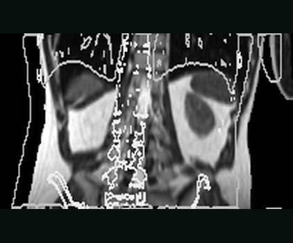
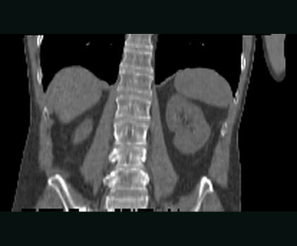
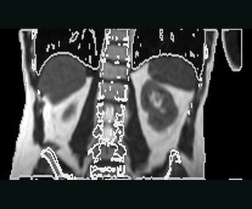
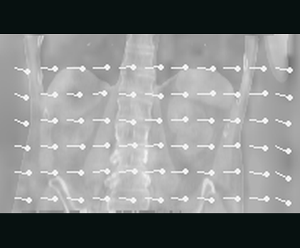

# Registration example

This example is the shortest complete path from a fixed/moving image pair to a
registered medical image in KonfAI. It prepares its own small dataset, trains
the built-in `VoxelMorph`, writes the warped image back as `.mha`, and measures
the error before and after registration.

It is deliberately a transparent learning task, not a clinical registration
recipe. Every `MOVING` image is a **real pelvis CT slice** pushed through a
displacement field the data-preparation script picks, so the answer is known
exactly while the anatomy is real. For registration between two *different*
patients — a genuine anatomical difference with no ground-truth field, scored on
reference segmentations — see {doc}`the IMPACT-Reg example <../usage/apps>` and
`examples/ImpactReg/`.

## Before you start

The example lives in the repository rather than in the Python wheel. From a
KonfAI checkout, install the ITK reader/writer and TensorBoard support used by
training:

```bash
python -m pip install -e ".[itk,tensorboard,fid]"
cd examples/Registration
```

`fid` is there for `scipy`, which `make_dataset.py` uses to apply the
displacement field; it is the only extra that carries it.

The commands below show GPU 0; replace `--gpu 0` with `--cpu 1` for a CPU-only
run, but note the shipped configuration is 400 epochs at `256 × 256` — about
three minutes on a GPU, considerably longer on CPU.

## What the example contains

```text
examples/Registration/
├── make_dataset.py            # builds the FIXED/MOVING pairs from real CT slices
├── Config.yml                 # training workflow
├── Prediction.yml             # checkpoint inference and MOVED output
├── Evaluation.yml             # MAE/MSE before and after registration
├── Registration_demo.ipynb    # the whole workflow as a runnable notebook
└── README.md
```

`make_dataset.py` takes six axial slices from each of the five public pelvis CT
cases, windows them to `[0, 1]`, and crops each to `256 × 256` around the body —
30 single-slice pairs in all:

```text
Dataset/
├── 1PC006_z014/
│   ├── FIXED.mha
│   └── MOVING.mha
├── 1PC006_z029/
│   ├── FIXED.mha
│   └── MOVING.mha
└── …
```

`FIXED` is the CT slice as acquired. `MOVING` is that same slice pushed through a
smooth displacement field of up to 8 voxels that the script chooses, so the
deformation to recover is known exactly while the anatomy is real. Build them
with:

```bash
python make_dataset.py
```

The CT comes from `VBoussot/konfai-demo` on the Hugging Face Hub, cached after
the first run. For registration between two *different* patients — a genuine
anatomical difference with no ground-truth field, scored on the reference
segmentations — see `examples/ImpactReg`.

## How the two images reach the model

`Config.yml` declares `FIXED` and `MOVING` as input groups. Their order is
load-bearing:

1. `FIXED` is model branch `0` and the target of the similarity loss.
2. `MOVING` is branch `1` and the image that the network warps.

The built-in `registration.registration.VoxelMorph` concatenates both inputs,
predicts a diffeomorphic deformation, and exposes the warped image at the named
module output `MovingImageResample`. Training attaches an MSE loss to that
output against `FIXED`.

```{important}
The current VoxelMorph warping components support `dim: 2`. Three values must
agree when adapting this example: VoxelMorph's `shape: [256, 256]`, the spatial
part of the patch `patch_size: [1, 256, 256]` in **both** `Config.yml` and
`Prediction.yml`, and `CROP` in `make_dataset.py`. A mismatch surfaces as a
`state_dict` load error at PREDICTION, not as a configuration error.
```

## Run train → predict → evaluate

`Registration_demo.ipynb` runs the three commands below and plots the
before/after — run every cell. To do it by hand instead:

### 1. Train the registration model

```bash
konfai TRAIN -y --gpu 0 --config Config.yml
```

The supplied configuration trains for 400 epochs (with `StepLR step_size: 150`
to match), reserves 25% of the 30 cases for validation, and writes:

```text
Checkpoints/REG_BASELINE/
Statistics/REG_BASELINE/
```

### 2. Materialise the registered images

Checkpoints are named after the moment they were written, and this example keeps
only the best one, so a glob resolves to exactly one file:

```bash
konfai PREDICTION -y --gpu 0 --config Prediction.yml \
  --models Checkpoints/REG_BASELINE/*.pt
```

For every case, prediction saves `MOVED.mha` under
`Predictions/REG_BASELINE/Dataset/`. `Prediction.yml` declares
`same_as_group: FIXED:FIXED`, so the registered image is written with the fixed
image geometry.

### 3. Compare alignment before and after

```bash
konfai EVALUATION -y --config Evaluation.yml
```

Evaluation reads the original `FIXED` and `MOVING` images together with the
predicted `MOVED` images, then writes:

```text
Evaluations/REG_BASELINE/Metric_TRAIN.json
```

The JSON contains both baselines:

- `MOVING:FIXED:MAE` and `MOVING:FIXED:MSE` measure error before registration.
- `MOVED:FIXED:MAE` and `MOVED:FIXED:MSE` measure error after registration.

On the 30 shipped CT slices at 400 epochs, a typical run reports `0.069 → 0.033`
for MAE and `0.017 → 0.0042` for MSE — a little over 2x and 4x. Exact values may
vary, but a useful run should make the after-registration errors clearly lower
than the matching before-registration errors.

Real anatomy is a far harder target than a synthetic phantom, and 400 epochs over
22 training slices is a demonstration rather than a trained model.

## What this baseline does—and does not—prove

This example demonstrates the complete KonfAI registration workflow: ordered
multi-input data, a named warped-image output, checkpoint inference, medical
image materialisation, and structured before/after evaluation. It intentionally
uses no augmentation and only an image-similarity MSE loss.

For a real deformable-registration study, you will normally add intensity
preprocessing, a task-appropriate similarity criterion such as normalized
cross-correlation, and a deformation-field smoothness regularizer. You must
also validate geometry and alignment on representative data rather than treating
successful execution as clinical evidence.

## See registration on real medical images

The four cards below come from a separate, executed IMPACT-Reg App run on
de-identified SynthRAD 2025 Task 1 abdomen case `1ABB123` (CC BY-NC 4.0).
They are **not outputs from the VoxelMorph tutorial
above**. This section demonstrates the packaged App path on real
medical images; the tutorial remains the small, reproducible learning exercise.
Full attribution and hashes are in the
<a href="../_static/apps/ASSET_PROVENANCE.md">asset provenance manifest</a>.

<ul class="kf-example-grid kf-example-grid--registration" aria-label="Real IMPACT-Reg execution stages, separate from the VoxelMorph tutorial">
  <li><figure class="kf-example-card"><a class="kf-example-media" href="../_static/apps/impact-reg/moving-before.png" aria-label="Open the real moving MR before registration"></a><figcaption><span class="kf-example-step">01 · REAL APP INPUT</span><strong>Moving MR — before</strong><span>Fixed-CT contours expose the controlled metadata-only offset.</span><span class="kf-example-stats">NCC 0.129 · MAE 106.11</span></figcaption></figure></li>
  <li><figure class="kf-example-card"><a class="kf-example-media" href="../_static/apps/impact-reg/fixed-ct.png" aria-label="Open the real fixed CT target"></a><figcaption><span class="kf-example-step">02 · REAL REFERENCE</span><strong>Fixed CT target</strong><span>The reference image defines the physical output grid.</span><span class="kf-example-stats">222 × 226 × 124 · 2 MM GRID</span></figcaption></figure></li>
  <li><figure class="kf-example-card"><a class="kf-example-media" href="../_static/apps/impact-reg/moved-after.png" aria-label="Open the real moved MR after registration"></a><figcaption><span class="kf-example-step">03 · REAL APP OUTPUT</span><strong>Moved MR — after</strong><span><code>ConvexAdam_Composite</code> writes the moved image on the fixed grid.</span><span class="kf-example-stats">NCC 0.937 · MAE 21.09</span></figcaption></figure></li>
  <li><figure class="kf-example-card"><a class="kf-example-media" href="../_static/apps/impact-reg/displacement-field.png" aria-label="Open the physical displacement-field visualization"></a><figcaption><span class="kf-example-step">04 · PHYSICAL FIELD</span><strong>Displacement field</strong><span>Three physical components in millimetres, with sampled vectors.</span><span class="kf-example-stats">MEAN 23.06 MM · P95 25.55 MM</span></figcaption></figure></li>
</ul>

<p class="kf-example-caption"><strong>One real pair, one completed IMPACT-Reg App execution.</strong><span>Controlled origin offset · <code>ConvexAdam_Composite</code> · NCC 0.129 → 0.937 · moved image + DVF + reusable transform</span></p>

The {ref}`registration gallery <gallery-registration>` presents the same
execution alongside the transform and augmentation evidence. Its generator
validates the fixed-grid geometry and reads the completed medical-image
artifacts; it does not synthesize a decorative before/after result.

See {doc}`../usage/apps` for the preset, measured before/after similarity,
fixed-grid geometry checks, reusable transform, and Slicer delivery path.

## Adapt it to your data

Start by changing:

1. `dataset_filenames` and the `FIXED`/`MOVING` group names;
2. preprocessing for your image modalities;
3. patch size and the matching VoxelMorph `shape`;
4. `train_name`, batch size, and validation split;
5. the similarity loss and deformation regularization.

Keep the fixed input first, the moving input second, and verify the written
geometry and before/after metrics on every adaptation.
