# KonfAI on real data

See KonfAI do the work on real medical-imaging data: a regional read from a
1.06-billion-voxel OME-Zarr pyramid, nine deterministic transforms, six sampled
augmentations, and a complete deformable registration. The transform and
augmentation panels use one axial CT slice from a real paired abdominal case
(`1ABB124`, SynthRAD 2025 Task 1, CC BY-NC 4.0). Every processed panel is
generated by the actual KonfAI class or App named in its title; no patient
identifier or image metadata is retained in the PNG. Dataset attribution and
hashes are recorded in the
<a href="../_static/apps/ASSET_PROVENANCE.md">visual asset provenance manifest</a>.

The images are explanatory, not a recommendation for clinical preprocessing.
Choose ranges and probabilities from the intensity distribution, voxel spacing,
anatomy, acquisition protocol, and invariances of your task.

<div class="kf-gallery-marker" aria-hidden="true"></div>

<nav class="kf-gallery-nav" aria-label="Visual evidence on this page">
  <strong>Explore the evidence</strong>
  <a href="#gallery-scale">Regional OME-Zarr read</a>
  <a href="#gallery-transforms">Deterministic transforms</a>
  <a href="#gallery-augmentations">Random augmentations</a>
  <a href="#gallery-registration">Deformable registration</a>
  <a href="#gallery-provenance">Provenance</a>
</nav>

(gallery-scale)=
## Scale: a real OME-Zarr regional read

<figure class="kf-visual kf-visual--wide">
  <a class="kf-visual-frame" href="../_static/gallery/scale-omezarr.webp" aria-label="Open the OME-Zarr regional-read figure at full resolution">
    <picture>
      <source media="(max-width: 640px)" srcset="../_static/gallery/scale-omezarr-mobile.webp" width="500" height="2147">
      
    </picture>
  </a>
  <figcaption>
    <span class="kf-visual-copy">
      <strong>Storage proof, not an illustration.</strong>
      <span class="kf-visual-meta">Case 822175 · 1.06 billion voxels · 0.50 MiB native window materialised</span>
    </span>
    <a class="kf-visual-inspect" href="../_static/gallery/scale-omezarr.webp">Inspect 1530 × 900 <span aria-hidden="true">↗</span></a>
  </figcaption>
</figure>

The source is a real two-level ExaSPIM OME-Zarr store from AIND specimen
`822175` (CC BY 4.0). KonfAI reads its metadata, one coarse plane, one 512²
native window, and the matching mask window. The figure therefore visualises
the storage-to-patch path itself rather than an artist's diagram. See
{doc}`../usage/large-images` for the execution rules and exact reproduction
command; the <a href="../_static/apps/ASSET_PROVENANCE.md">provenance manifest</a>
records the public source and hashes.

(gallery-transforms)=
## Deterministic transforms

Transforms run in training, prediction, and evaluation wherever they are
declared. Their state can also carry the information required to invert an
operation when predictions are written.

<ul class="kf-example-grid" aria-label="Deterministic transform examples on one real abdominal CT plane">
  <li><figure class="kf-example-card"><a class="kf-example-media" href="../_static/gallery/transforms/source.png" aria-label="Open the source CT plane">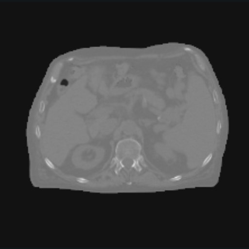</a><figcaption><strong>Source</strong><span>Real paired abdominal CT · unchanged HU</span><span class="kf-example-stats">MIN −1024.00 · MEAN −586.57 · MAX 979.32</span></figcaption></figure></li>
  <li><figure class="kf-example-card"><a class="kf-example-media" href="../_static/gallery/transforms/clip.png" aria-label="Open the Clip output"></a><figcaption><strong>Clip</strong><span>Values above 100 HU flattened · same display window</span><span class="kf-example-stats">MIN −1000.00 · MEAN −575.52 · MAX 100.00</span></figcaption></figure></li>
  <li><figure class="kf-example-card"><a class="kf-example-media" href="../_static/gallery/transforms/normalize.png" aria-label="Open the Normalize output">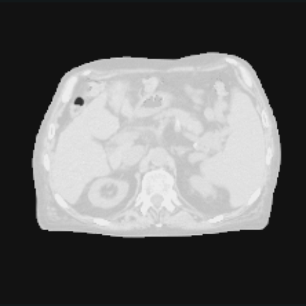</a><figcaption><strong>Normalize</strong><span>Target numerical range [−1, 1]</span><span class="kf-example-stats">MIN −1.00 · MEAN −0.23 · MAX 1.00</span></figcaption></figure></li>
  <li><figure class="kf-example-card"><a class="kf-example-media" href="../_static/gallery/transforms/standardize.png" aria-label="Open the Standardize output"></a><figcaption><strong>Standardize</strong><span>Automatic mean and standard deviation</span><span class="kf-example-stats">MIN −0.87 · MEAN 0.00 · MAX 3.11</span></figcaption></figure></li>
  <li><figure class="kf-example-card"><a class="kf-example-media" href="../_static/gallery/transforms/resample-shape.png" aria-label="Open the ResampleToShape output">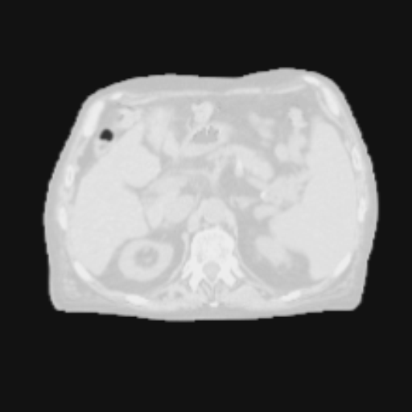</a><figcaption><strong>Resample to shape</strong><span>219 × 222 → 220 × 220 voxels</span><span class="kf-example-stats">OUTPUT GRID 220 × 220</span></figcaption></figure></li>
  <li><figure class="kf-example-card"><a class="kf-example-media" href="../_static/gallery/transforms/resample-spacing.png" aria-label="Open the ResampleToResolution output">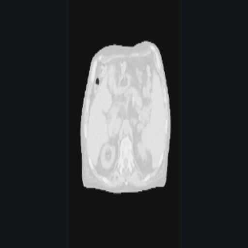</a><figcaption><strong>Resample spacing</strong><span>0.80 × 0.80 → 1.25 × 0.55 mm</span><span class="kf-example-stats">GEOMETRY-AWARE INTERPOLATION</span></figcaption></figure></li>
  <li><figure class="kf-example-card"><a class="kf-example-media" href="../_static/gallery/transforms/padding.png" aria-label="Open the Padding output">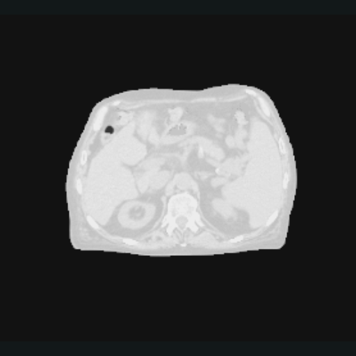</a><figcaption><strong>Padding</strong><span>Constant −1 border around the source grid</span><span class="kf-example-stats">[28, 28, 18, 18] VOXELS</span></figcaption></figure></li>
  <li><figure class="kf-example-card"><a class="kf-example-media" href="../_static/gallery/transforms/crop.png" aria-label="Open the Crop output">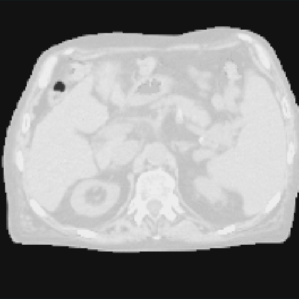</a><figcaption><strong>Crop</strong><span>Configured central ROI with geometry update</span><span class="kf-example-stats">ROI 177 × 178 VOXELS</span></figcaption></figure></li>
  <li><figure class="kf-example-card"><a class="kf-example-media" href="../_static/gallery/transforms/permute.png" aria-label="Open the Permute output">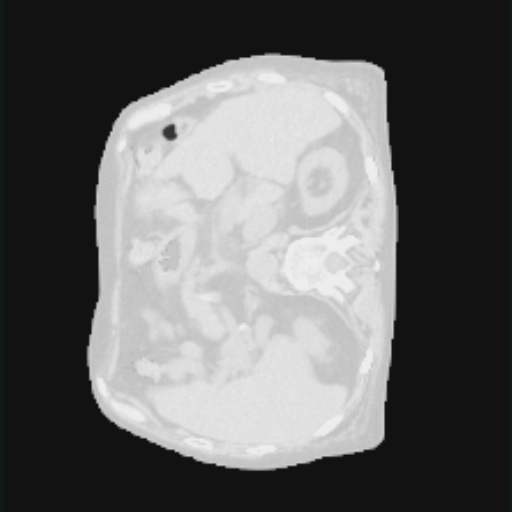</a><figcaption><strong>Permute axes</strong><span>Swap the two spatial dimensions</span><span class="kf-example-stats">219 × 222 → 222 × 219</span></figcaption></figure></li>
  <li><figure class="kf-example-card"><a class="kf-example-media" href="../_static/gallery/transforms/gradient.png" aria-label="Open the Gradient output">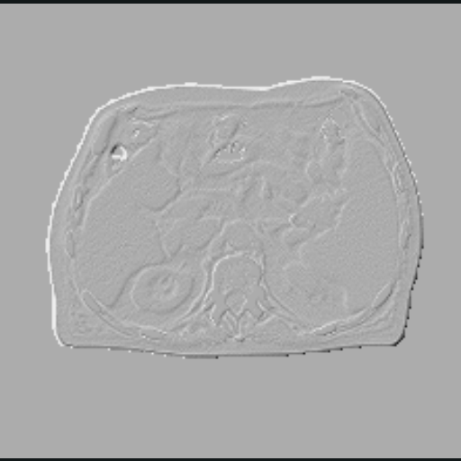</a><figcaption><strong>Gradient</strong><span>Spatial edge magnitude</span><span class="kf-example-stats">MIN 0.01 · MEAN 0.71 · MAX 1.40</span></figcaption></figure></li>
</ul>

<p class="kf-example-caption"><strong>One source slice, nine direct KonfAI transform outputs.</strong><span>Open any card independently · real abdominal CT · intensity, grid, spacing, orientation, and edge operations</span></p>

Matching YAML:

```yaml
groups_dest:
  CT:
    transforms:
      Clip:
        min_value: -1000
        max_value: 100
      Normalize:
        min_value: -1
        max_value: 1
        inverse: true
      ResampleToResolution:
        spacing: [1.25, 0.55]
        inverse: true
      Padding:
        padding: [28, 28, 18, 18]
        mode: constant:-1
```

`Clip` flattens values above 100 HU so the bright cortical bone disappears; its
panel deliberately keeps exactly the same `[-1000, 1000] HU` display window as
the source. Every card uses the same classic medical grayscale, with only the
pure black and clipped white endpoints softened; tensor values are unchanged.
`Normalize` preserves the relative anatomy
while changing the numerical range. `Standardize` centers the distribution and
scales it by its standard deviation; its visual appearance depends on the
display window, which is why each card also reports min, mean, and max. The
spatial cards make geometry changes explicit: resampling reports
the source and destination shape or spacing, padding expands the grid, crop
updates the region of interest, `Permute` swaps axes, and `Gradient` exposes
spatial edges. Every panel is the direct output of the named KonfAI class.

(gallery-augmentations)=
## Random augmentations

Augmentations are sampled per case and shared by every patch of that case during
an epoch. The fixed seeds used to build this page make the documentation
reproducible; normal training draws new states after the epoch reset.

<ul class="kf-example-grid" aria-label="Sampled augmentation examples on one real abdominal CT plane">
  <li><figure class="kf-example-card"><a class="kf-example-media" href="../_static/gallery/augmentations/source.png" aria-label="Open the augmentation source"></a><figcaption><strong>Source</strong><span>Shared clipped and normalized reference</span><span class="kf-example-stats">FIXED DOCUMENTATION SEEDS</span></figcaption></figure></li>
  <li><figure class="kf-example-card"><a class="kf-example-media" href="../_static/gallery/augmentations/flip.png" aria-label="Open the Flip output">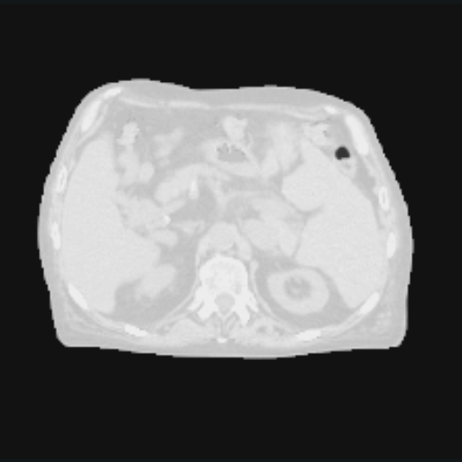</a><figcaption><strong>Flip</strong><span>Deterministic horizontal sample</span><span class="kf-example-stats">f_prob [0, 1]</span></figcaption></figure></li>
  <li><figure class="kf-example-card"><a class="kf-example-media" href="../_static/gallery/augmentations/rotate.png" aria-label="Open the Rotate output">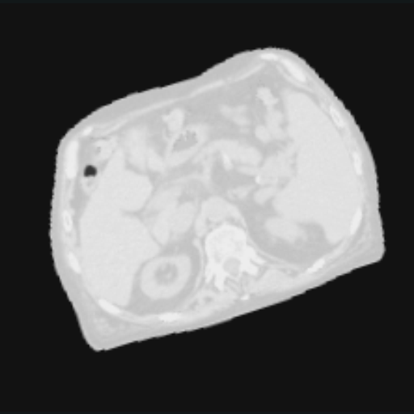</a><figcaption><strong>Rotate</strong><span>Spatial transform shared across the case</span><span class="kf-example-stats">a_min 18° · a_max 18°</span></figcaption></figure></li>
  <li><figure class="kf-example-card"><a class="kf-example-media" href="../_static/gallery/augmentations/brightness.png" aria-label="Open the Brightness output">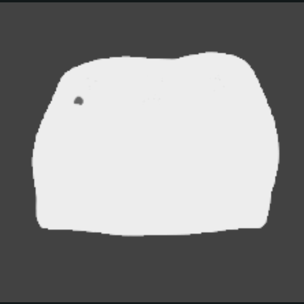</a><figcaption><strong>Brightness</strong><span>Sampled intensity offset</span><span class="kf-example-stats">b_std 0.35</span></figcaption></figure></li>
  <li><figure class="kf-example-card"><a class="kf-example-media" href="../_static/gallery/augmentations/contrast.png" aria-label="Open the Contrast output">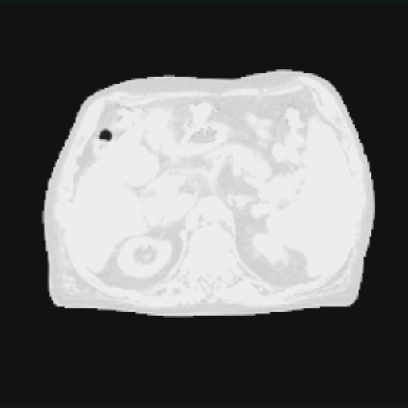</a><figcaption><strong>Contrast</strong><span>Sampled intensity scale</span><span class="kf-example-stats">c_std 0.75</span></figcaption></figure></li>
  <li><figure class="kf-example-card"><a class="kf-example-media" href="../_static/gallery/augmentations/noise.png" aria-label="Open the Noise output">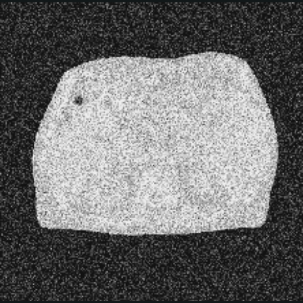</a><figcaption><strong>Noise</strong><span>Sampled below a 55% timestep ceiling</span><span class="kf-example-stats">n_std 0.65 · prob 0.55</span></figcaption></figure></li>
  <li><figure class="kf-example-card"><a class="kf-example-media" href="../_static/gallery/augmentations/cutout.png" aria-label="Open the CutOUT output">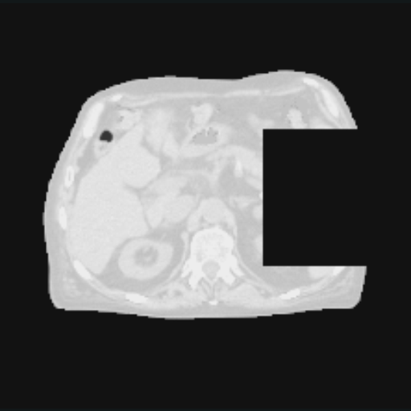</a><figcaption><strong>CutOUT</strong><span>Rectangular region replaced by −1</span><span class="kf-example-stats">cutout_size 0.34 · c_prob 1</span></figcaption></figure></li>
</ul>

<p class="kf-example-caption"><strong>One source image, six sampled augmentation states.</strong><span>Open any card independently · fixed documentation seeds · shared spatial state across a case</span></p>

One typical training block (the fixed documentation render forces each shown
state to run so the visual comparison is deterministic):

```yaml
Dataset:
  augmentations:
    SpatialAndIntensity:
      nb: 1
      data_augmentations:
        Rotate:
          a_min: -18
          a_max: 18
          prob: 0.5
        Contrast:
          c_std: 0.75
          prob: 0.3
        Noise:
          n_std: 0.65
          prob: 0.55
```

```{important}
For `Noise`, `prob` controls the maximum diffusion timestep rather than a
standard apply/do-not-apply probability. For spatial transforms, label maps
follow the same sampled geometry and use nearest-neighbour interpolation.
```

(gallery-registration)=
## Registration: moving image to physical field

<ul class="kf-example-grid kf-example-grid--registration" aria-label="Executed deformable-registration stages">
  <li><figure class="kf-example-card"><a class="kf-example-media" href="../_static/apps/impact-reg/moving-before.png" aria-label="Open the moving MR before registration"></a><figcaption><span class="kf-example-step">01 · INPUT</span><strong>Moving MR — before</strong><span>Fixed-CT contours expose the controlled offset</span><span class="kf-example-stats">NCC 0.129 · MAE 106.11</span></figcaption></figure></li>
  <li><figure class="kf-example-card"><a class="kf-example-media" href="../_static/apps/impact-reg/fixed-ct.png" aria-label="Open the fixed CT target"></a><figcaption><span class="kf-example-step">02 · REFERENCE</span><strong>Fixed CT target</strong><span>Reference geometry and output grid</span><span class="kf-example-stats">222 × 226 × 124 · 2 MM GRID</span></figcaption></figure></li>
  <li><figure class="kf-example-card"><a class="kf-example-media" href="../_static/apps/impact-reg/moved-after.png" aria-label="Open the moved MR after registration"></a><figcaption><span class="kf-example-step">03 · OUTPUT</span><strong>Moved MR — after</strong><span>ConvexAdam_Composite output on the fixed grid</span><span class="kf-example-stats">NCC 0.937 · MAE 21.09</span></figcaption></figure></li>
  <li><figure class="kf-example-card"><a class="kf-example-media" href="../_static/apps/impact-reg/displacement-field.png" aria-label="Open the physical displacement field"></a><figcaption><span class="kf-example-step">04 · FIELD</span><strong>Displacement field</strong><span>Three physical components with sampled vectors</span><span class="kf-example-stats">MEAN 23.06 MM · P95 25.55 MM</span></figcaption></figure></li>
</ul>

<p class="kf-example-caption"><strong>One real moving/fixed pair, one executed IMPACT-Reg App.</strong><span>Open each stage independently · ConvexAdam_Composite · NCC 0.129 → 0.937 · moved image + DVF + reusable transform</span></p>

The input is de-identified SynthRAD 2025 Task 1 abdomen case `1ABB123`
(CC BY-NC 4.0), with a controlled metadata-only offset. Full attribution and
hashes are in the
<a href="../_static/apps/ASSET_PROVENANCE.md">asset provenance manifest</a>.
The App writes the moved MR, a three-component displacement field in
millimetres, and a reusable transform on the fixed CT grid. The documentation
generator reads and validates every plane from the real moving and output
volumes; it does not reconstruct a decorative before/after image. See
{doc}`../usage/apps` for the exact preset, measurements, evaluation, and Slicer
workflow.

(gallery-provenance)=
## How the figures stay trustworthy

Recreate the same transform sequence on the maintained public quickstart case:

```bash
hf download VBoussot/konfai-demo Segmentation/1PC006/CT.mha \
  --repo-type dataset --local-dir /tmp/konfai-doc-gallery
pixi run --environment dev python docs/scripts/generate_visual_gallery.py \
  --input /tmp/konfai-doc-gallery/Segmentation/1PC006/CT.mha \
  --slice-index 49
```

The public command deliberately substitutes a different case, so it validates
the transform logic rather than reproducing the committed pixel values. The
dimensions and numerical captions above describe the committed 1ABB124 slice;
update them if you replace those assets with another case.

The generator imports `Clip`, `Normalize`, `Standardize`, both resampling
variants, `Padding`, `Crop`, `Permute`, `Gradient`, and every named augmentation
directly from KonfAI. It drives augmentations through their public per-case
lifecycle. The committed board uses the real abdominal CT case `1ABB124`;
the command above offers a maintained public alternative with different anatomy
and identical transform logic. Both paths extract only the selected axial
plane. If `--input` is omitted during local experimentation, the script falls
back to a procedural phantom; that fallback is never used to represent an App
prediction. The registration board is built separately by
`generate_registration_proof_gallery.py` from completed App outputs and
validates fixed-grid geometry plus decoded moving/reference voxel equality one
plane at a time.

## Next steps

- {doc}`../reference/components/transforms` — every transform and argument
- {doc}`../reference/components/augmentations` — every augmentation and lifecycle detail
- {doc}`segmentation` — use preprocessing and augmentation in a complete task
- {doc}`../usage/apps` — reproduce registration, evaluation, uncertainty, and Slicer delivery
