# Using KonfAI Apps

KonfAI Apps are the **deployment and reuse layer** of the framework: packaged
workflows that expose a stable user interface on top of KonfAI's low-level
prediction, evaluation, uncertainty, and fine-tuning logic. This page explains
what an app is and shows how to drive packaged apps with the `konfai-apps`
CLI — locally or against a remote server.

The screenshots below show Apps running through the real SlicerKonfAI client.
They are actual interface captures with medical inputs and returned results—not
procedural illustrations or simulated predictions.

## What an app is

Where low-level KonfAI workflows are designed directly through YAML files and
local Python modules, a KonfAI App bundles those assets into a reusable package
that can run through:

- `konfai-apps` on the command line
- Python via `konfai_apps.KonfAIApp`
- a remote FastAPI server via `konfai-apps-server`
- clients such as 3D Slicer integrations

An end user does not need to write YAML to consume a published App. The YAML is
still inside the bundle as the inspectable workflow record, so the same App can
later be evaluated, fine-tuned, served, or automated instead of being replaced
by an unrelated deployment script.

A KonfAI App repository is recognized by the presence of an `app.json` file.
Typical contents are:

```text
my_app/
├── app.json
├── Prediction.yml
├── Evaluation.yml
├── Uncertainty.yml
└── checkpoint.pt
```

Depending on the app, some files are optional:

- `Prediction.yml` is the core inference entrypoint
- `Evaluation.yml` is needed for `eval`
- `Uncertainty.yml` is needed for `uncertainty`
- fine-tuning relies on training assets and checkpoint files that live next to the app

**When to use apps.** Use low-level YAML workflows when you are still designing
or debugging a model. Package it as a KonfAI App once that workflow is stable
and you want:

- a stable inference interface — a smaller, more repeatable interface for end users
- reusable packaging for a team
- distribution through Hugging Face or a private repository
- local and remote execution with the same user-facing command

## Turn a trained workflow into an App

The `bundle` command is the research-to-application handoff. It validates the
metadata, copies prediction/evaluation configs and checkpoints, includes custom
Python when needed, and produces the directory layout understood by local,
Hugging Face, and server resolvers.

Create `app.json`:

```json
{
  "display_name": "My segmentation model",
  "description": "Segments the target anatomy from CT.",
  "short_description": "CT segmentation",
  "tta": 0,
  "mc_dropout": 0
}
```

Then assemble the tested artifacts:

```bash
konfai-apps bundle CT_SEG \
  --out dist \
  --app-json app.json \
  --config Prediction.yml Evaluation.yml \
  --checkpoint Checkpoints/SEG_BASELINE/best.pt \
  --model-py Model.py
```

The result is `dist/CT_SEG/`. `app.json.models` is filled from the checkpoint
filenames when omitted, and an omitted `requirements.txt` is drafted from
`Model.py` imports. Review that draft—it is a convenience, not a reproducible
environment lock.

Validate the bundle locally before publishing:

```bash
konfai-apps infer ./dist/CT_SEG -i input.mha -o ./Output --gpu 0
konfai-apps eval ./dist/CT_SEG -i ./Output/<prediction>.mha --gt reference.mha
```

Inspect the output medical image, geometry, and evaluation values; a command
returning successfully is not sufficient validation. Once local inference is
equivalent to the research workflow, upload the `CT_SEG/` folder as a variant
inside a Hugging Face model repository and address it as `owner/repository:CT_SEG`.

If the workflow uses no custom Python, omit `--model-py`. ONNX export is an
experimental optional addition (`--onnx`), not required for normal PyTorch App
execution.

## The `konfai-apps` CLI

The app CLI currently exposes these subcommands:

- `infer`
- `eval`
- `uncertainty`
- `pipeline`
- `fine-tune`
- `bundle`
- `download`

The main command pattern is:

```bash
konfai-apps <command> <app> [options]
```

## App identifiers

Apps can be local or remote repository identifiers. The repository examples and
tests show Hugging Face style identifiers such as:

- ``VBoussot/ImpactSynth:MR``
- ``VBoussot/ImpactSynth:CBCT``
- ``VBoussot/TotalSegmentator-KonfAI:total``

## Ready-to-run Apps with measured workloads

The published bundles are not toy examples. They package full medical models,
their preprocessing and reconstruction, evaluation where available, and the
metadata consumed by CLI, server, and Slicer clients.

| App | Executable workload | Published bundle benchmark |
| --- | --- | --- |
| `TotalSegmentator-KonfAI` | CT → 117 labels (`total`: 5 models; `total-3mm`: 1), MRI → 50 labels (`total_mr`: 2; `total_mr-3mm`: 1) | CT `total`: ≈42 s, ≈20 GB VRAM and ≈19 GB RAM; original TotalSegmentator ≈76 s on the same case |
| `MRSegmentator-KonfAI:MRSegmentator` | MRI → 40 labels, five-fold ensemble | ≈27 s, ≈22 GB VRAM and ≈2 GB RAM; original MRSegmentator ≈35 s and ≈11 GB RAM on the same case |
| `ImpactSeg:body` | one CT/MR/CBCT model → 11 structures | ≈7 s, ≈10 GB VRAM and ≈1.6 GB RAM |
| `ImpactSynth` | four MR/CBCT→sCT variants, five models each | ≈24 s and ≈16 GB VRAM for the benchmark inference; ≈82 s for all five; ≈2 GB RAM |
| `ImpactReg:ConvexAdam_Composite` | fixed + moving → `MovedImage` and `DisplacementField` on the fixed grid | ≈5.1 s and ≈2.1 GB VRAM on a real abdominal MR→CT pair |

These are the conditions reported by each bundle README on an NVIDIA RTX PRO
5000 24 GB. Inputs and tasks differ, so the rows demonstrate deployable scale;
they are not an apples-to-apples model leaderboard. Patch size, ensemble size,
case dimensions and GPU placement are part of every result.

Together these READMEs describe four TotalSegmentator tasks, a five-fold
MRSegmentator, one modality-agnostic ImpactSeg model, four ImpactSynth variants,
and thirteen IMPACT-Reg presets. These are deployable medical workflows, not a
catalogue of untrained architecture names.

### One real case through the complete App workflow

The cards below are built from de-identified SynthRAD 2025 Task 1 abdomen case
`1ABB124` and the medical-image artifacts produced by the published Apps.
The source case is distributed under CC BY-NC 4.0; the exact attribution,
input/output hashes, and panel hashes are recorded in the
<a href="../_static/apps/ASSET_PROVENANCE.md">asset provenance manifest</a>.
ImpactSynth ran five
checkpoints over the original input and two test-time augmentations (15 states);
the full TotalSegmentator App ran its five checkpoints on the resulting sCT.
KonfAI then executed the App's evaluation and reference-free uncertainty
workflows—there are no fabricated predictions in this figure.

Each panel uses the same physical axial plane. The heat-map limits are robust
display ranges; the headline values come from the completed per-case metric
JSON, not from the displayed slice alone. ImpactSynth's uncertainty is its
configured ensemble variance expressed as a percentage of the bundle baseline.
The displayed anatomy is the full five-model `total` output. Dice 0.665 comes
from a separate, single-checkpoint `total-3mm` evaluation branch and is not a
score assigned to the displayed five-model overlay.

<ul class="kf-example-grid kf-example-grid--compact" aria-label="Completed real-data KonfAI App workflow stages">
  <li><figure class="kf-example-card"><a class="kf-example-media" href="../_static/apps/impact-synth/mr-input.png" aria-label="Open the real abdominal MR input">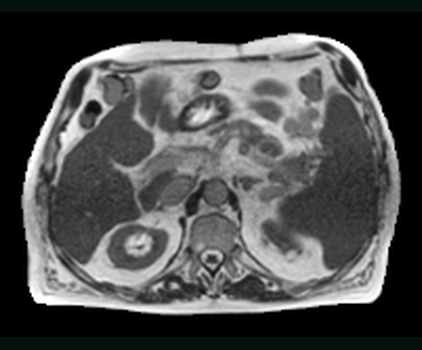</a><figcaption><span class="kf-example-step">01 · INPUT</span><strong>MR input</strong><span>One extracted plane from the paired abdominal case.</span><span class="kf-example-stats">Z +18 MM · 2 MM GRID</span></figcaption></figure></li>
  <li><figure class="kf-example-card"><a class="kf-example-media" href="../_static/apps/impact-synth/synthetic-ct.png" aria-label="Open the real ImpactSynth synthetic CT">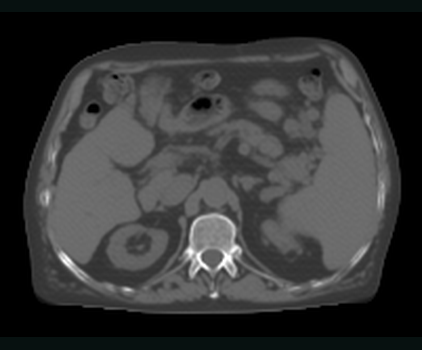</a><figcaption><span class="kf-example-step">02 · PREDICTION</span><strong>ImpactSynth sCT</strong><span>Five checkpoints over the original MR and two TTA states.</span><span class="kf-example-stats">15 INFERENCE STATES</span></figcaption></figure></li>
  <li><figure class="kf-example-card"><a class="kf-example-media" href="../_static/apps/impact-synth/reference-ct.png" aria-label="Open the paired real CT reference">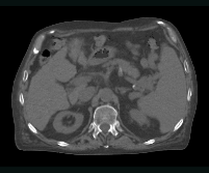</a><figcaption><span class="kf-example-step">03 · REFERENCE</span><strong>Paired CT</strong><span>The real target stays separate from the generated image.</span><span class="kf-example-stats">SAME PHYSICAL PLANE · 2 MM GRID</span></figcaption></figure></li>
  <li><figure class="kf-example-card"><a class="kf-example-media" href="../_static/apps/impact-synth/totalsegmentator.png" aria-label="Open the real TotalSegmentator anatomy output">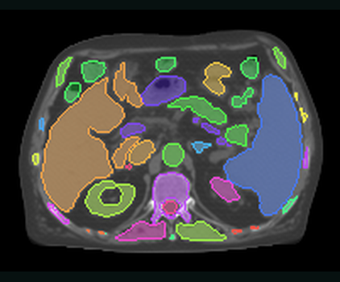</a><figcaption><span class="kf-example-step">04 · DOWNSTREAM APP</span><strong>Total anatomy</strong><span>The full TotalSegmentator ensemble runs directly on the sCT artifact.</span><span class="kf-example-stats">FULL TOTAL OVERLAY · 5 MODELS</span></figcaption></figure></li>
  <li><figure class="kf-example-card"><a class="kf-example-media" href="../_static/apps/impact-synth/mae-map.png" aria-label="Open the real ImpactSynth evaluation map">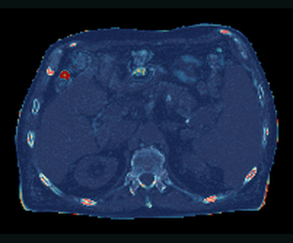</a><figcaption><span class="kf-example-step">05 · EVALUATION</span><strong>Absolute-error map</strong><span>Display range 0–438.20 HU (P99); case scores use the complete metric volume.</span><span class="kf-example-stats">MAE 22.94 HU · PSNR 34.16 DB · SSIM 0.913</span></figcaption></figure></li>
  <li><figure class="kf-example-card"><a class="kf-example-media" href="../_static/apps/impact-synth/uncertainty-map.png" aria-label="Open the real ImpactSynth uncertainty map">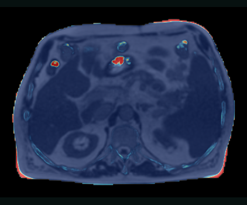</a><figcaption><span class="kf-example-step">06 · UNCERTAINTY</span><strong>Ensemble uncertainty</strong><span>Display range 0–4520.81% of baseline (P99) across the 15 states.</span><span class="kf-example-stats">MEAN 109.61% BASELINE · DISAGREEMENT 0.016</span></figcaption></figure></li>
</ul>

<p class="kf-example-caption"><strong>One real case, one continuous App workflow.</strong><span>MR → 15-state sCT → five-model anatomy · evaluation and uncertainty remain medical-image datasets</span></p>

Reproduction snapshot: KonfAI `5195b79`; ImpactSynth `db04a8e`. The committed
generator requests one plane from each image through SimpleITK's extraction
API. Compressed MHA inputs may still require internal backend decompression.

## Common app workflows

These commands all use the same app package, but they expose different levels
of workflow orchestration.

| App family | Typical input | Materialised result | Additional workflow |
| --- | --- | --- | --- |
| Segmentation | CT, MR, or CBCT | label map on the input grid | Dice evaluation, ensemble/TTA uncertainty |
| Synthesis | MR or CBCT | synthetic CT with reference geometry | masked MAE/SSIM-style evaluation, uncertainty |
| Registration | fixed + moving images | moved image, DVF, transform | image/label/landmark evaluation, field uncertainty |

Inference:

```bash
konfai-apps infer VBoussot/ImpactSynth:CBCT \
  -i input.mha -o ./Output --gpu 0
```

Evaluation:

```bash
konfai-apps eval VBoussot/ImpactSynth:CBCT \
  -i prediction.mha --gt ct.mha --mask mask.mha --gpu 0
```

Pipeline:

```bash
konfai-apps pipeline VBoussot/ImpactSynth:CBCT \
  -i input.mha --gt ct.mha --mask mask.mha -o ./Output -uncertainty
```

### Registration is a first-class App family

IMPACT-Reg packages thirteen rigid, rigid+B-spline, modality-specific MR/CT and
CBCT/CT semantic presets, native ConvexAdam stages, and FireANTs presets. A
preset produces the moved image and displacement field on the fixed grid. The
registration orchestrator can average fields from several presets, write a
reusable transform, evaluate image/segmentation/landmark pairs, and derive a
voxel-wise field-spread map.

```bash
impact-reg-konfai register MR_CT_MRSeg MR_CT_TS \
  -f fixed_ct.mha -m moving_mr.mha \
  --uncertainty -o ./Registration --gpu 0
```

The following cards use the published `ConvexAdam_Composite` preset on
de-identified SynthRAD 2025 Task 1 abdomen case `1ABB123`, distributed under
CC BY-NC 4.0 and detailed in the
<a href="../_static/apps/ASSET_PROVENANCE.md">asset provenance manifest</a>.
Because its MR was already aligned by
IMPACT, the test changes only its origin (`+20 mm` X, `-12 mm` Y); its decoded
voxel values remain exactly identical, verified one plane at a time. This
creates a known, reproducible offset without inventing anatomy or interpolating
an input image.

The App writes `Moved.mha`, a three-component `DVF.mha` in millimetres, and a
reusable `Transform.h5` on the fixed CT grid. Compared with the unshifted MR,
foreground NCC improves from `0.129` to `0.937` and MAE from `106.11` to
`21.09`. The field has a mean magnitude of `23.06 mm` and a 95th percentile of
`25.55 mm`. These validation values were accumulated one axial plane at a time.
The generator requests plane-sized outputs; compressed sources may still be
decompressed internally by the imaging backend.

<ul class="kf-example-grid kf-example-grid--registration" aria-label="Completed real-data IMPACT-Reg stages">
  <li><figure class="kf-example-card"><a class="kf-example-media" href="../_static/apps/impact-reg/moving-before.png" aria-label="Open the real moving MR before registration"></a><figcaption><span class="kf-example-step">01 · MOVING INPUT</span><strong>Moving MR — before</strong><span>Fixed-CT contours expose the controlled metadata-only offset.</span><span class="kf-example-stats">NCC 0.129 · MAE 106.11</span></figcaption></figure></li>
  <li><figure class="kf-example-card"><a class="kf-example-media" href="../_static/apps/impact-reg/fixed-ct.png" aria-label="Open the real fixed CT target">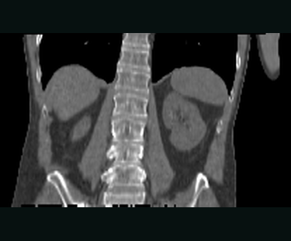</a><figcaption><span class="kf-example-step">02 · FIXED REFERENCE</span><strong>Fixed CT target</strong><span>The reference image defines the physical output grid.</span><span class="kf-example-stats">222 × 226 × 124 · 2 MM GRID</span></figcaption></figure></li>
  <li><figure class="kf-example-card"><a class="kf-example-media" href="../_static/apps/impact-reg/moved-after.png" aria-label="Open the real moved MR after registration">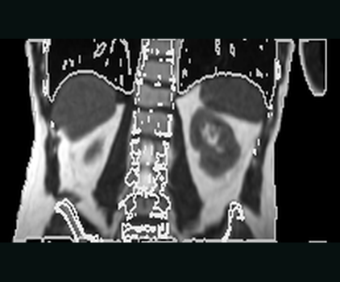</a><figcaption><span class="kf-example-step">03 · MOVED OUTPUT</span><strong>Moved MR — after</strong><span><code>ConvexAdam_Composite</code> writes the result on the fixed grid.</span><span class="kf-example-stats">NCC 0.937 · MAE 21.09</span></figcaption></figure></li>
  <li><figure class="kf-example-card"><a class="kf-example-media" href="../_static/apps/impact-reg/displacement-field.png" aria-label="Open the real physical displacement field">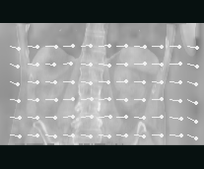</a><figcaption><span class="kf-example-step">04 · PHYSICAL FIELD</span><strong>Displacement field</strong><span>Three physical components in millimetres, with sampled vectors.</span><span class="kf-example-stats">MEAN 23.06 MM · P95 25.55 MM</span></figcaption></figure></li>
</ul>

<p class="kf-example-caption"><strong>A real registration run with an inspectable physical field.</strong><span>Controlled offset · <code>ConvexAdam_Composite</code> · NCC 0.129 → 0.937 · moved image + DVF + reusable transform</span></p>

The light-gray body and bone contours come from the fixed CT and are overlaid
unchanged before and after registration. DVF brightness encodes full 3-D
magnitude; the sparse arrows show its in-plane X/Z components. Reproduction
snapshot: KonfAI `5195b79`, ImpactReg `1e7ef81`.

The work also exists at dataset scale. The IMPACT pipeline produced and
published reusable Elastix B-spline transforms for:

- [SynthRAD 2023 IMPACT registrations](https://huggingface.co/datasets/VBoussot/synthrad2023-impact-registration): 317 MR→CT and 289 CBCT→CT transforms;
- [SynthRAD 2025 IMPACT registrations](https://huggingface.co/datasets/VBoussot/synthrad2025-impact-registration): 411 MR→CT and 638 CBCT→CT transforms.

These repositories contain transformation parameter files—not redistributed
patient images. Each transform aligns the alternate modality into CT space.
The released registrations use third-order B-splines, four resolution levels
and a final 10 mm grid; their dataset cards document exclusions and the
CC BY-NC 4.0 terms. They are concrete research artifacts behind the aligned
pairs used to train and evaluate the synthesis workflows.

## Grouped inputs

The CLI accepts grouped inputs by repeating `--inputs` / `-i`. This matches the
grouping behavior documented in `konfai_apps.cli.add_common_konfai_apps()`.

Use this when an app expects:

- multiple input groups
- multiple files per group
- paired inputs such as image + mask

## Fine-tuning

Fine-tuning is available through:

```bash
konfai-apps fine-tune <app> <name> -d ./Dataset --epochs 10 --gpu 0
konfai-apps fine-tune <app> <name> -d ./Dataset --models CV_0 CV_1 --epochs 10 --gpu 0
```

Under the hood, the app installs training assets, links the dataset, then, for each selected
checkpoint, restarts training from its pretrained weights (fresh optimizer, learning-rate schedule
and epoch counter) so that `--epochs` fine-tuning epochs actually run. Use `--models` to choose which
checkpoint(s) to fine-tune (default: the first available); each is fine-tuned independently and
written back into the output app, which is left as a ready-to-use app bundle.

## Remote execution

Any `konfai-apps` command becomes remote as soon as `--host` is provided — the
CLI still looks the same; only the execution backend changes. The client then:

1. uploads inputs
2. schedules the job
3. streams logs over SSE
4. downloads the zipped result bundle

On the server side, jobs are queued, optionally assigned GPUs, executed in
isolated temporary workspaces, and cleaned up after a grace period.

### Start the server

The server requires a JSON file listing the available apps:

```bash
konfai-apps-server --host 0.0.0.0 --port 8000 --apps konfai-apps/tests/assets/apps.json
```

Bearer-token authentication is enabled by default:

```bash
export KONFAI_API_TOKEN="my-secret-token"
konfai-apps-server --apps konfai-apps/tests/assets/apps.json
```

See {doc}`../reference/cli` for the full `konfai-apps-server` flag reference.

### Run a remote job

```bash
konfai-apps infer VBoussot/ImpactSynth:CBCT \
  -i input.mha -o ./Output \
  --host my.server.org --port 8000 --token "$KONFAI_API_TOKEN"
```

The complete HTTP contract behind this — health, device, and app metadata
endpoints plus job status, log, result, and kill endpoints — is documented in
{doc}`../reference/app-server-api`.

## Use the same App from 3D Slicer

[SlicerKonfAI](https://github.com/vboussot/SlicerKonfAI) is the external 3D
Slicer client for KonfAI Apps. It lets a user select an App, map Slicer volumes
to its declared inputs, launch local or remote execution, and load returned
volumes or segmentations into the scene.

Treat Slicer as another client of the validated App, not a separate model
package: test the bundle with `konfai-apps infer` first, then configure the same
identifier in SlicerKonfAI. The integration is currently external and its
progress/output contract is less stable than the core Python API; pin compatible
KonfAI Apps and SlicerKonfAI versions for clinical-facing installations.

### The real SlicerKonfAI workflow

These are official SlicerKonfAI interface captures, not mockups. The inference
view exposes the selected App and its description, ensemble/TTA/MC-dropout
controls, device and memory state, live KonfAI logs, and the returned medical
result in the Slicer viewers.

<figure class="kf-visual kf-visual--app">
  <a class="kf-visual-frame" href="../_static/slicer/inference.webp" aria-label="Open the SlicerKonfAI inference screenshot at full resolution">
    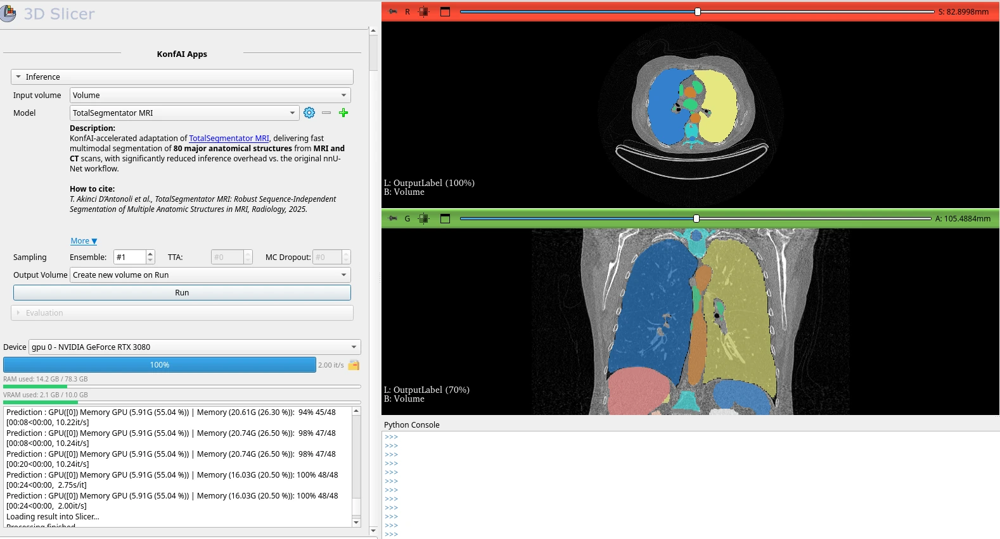
  </a>
  <figcaption>
    <span class="kf-visual-copy">
      <strong>Inference stays inside the clinical imaging workspace.</strong>
      <span class="kf-visual-meta">TotalSegmentator MRI · App selection, sampling controls, live logs, and returned segmentation</span>
    </span>
    <a class="kf-visual-inspect" href="../_static/slicer/inference.webp">Inspect 1578 × 852 <span aria-hidden="true">↗</span></a>
  </figcaption>
</figure>

The same module keeps QA attached to the App. Without a reference, it consumes
the inference stack and loads the App's uncertainty image and summary metric:

<figure class="kf-visual kf-visual--app">
  <a class="kf-visual-frame" href="../_static/slicer/uncertainty.png" aria-label="Open the SlicerKonfAI uncertainty screenshot at full resolution">
    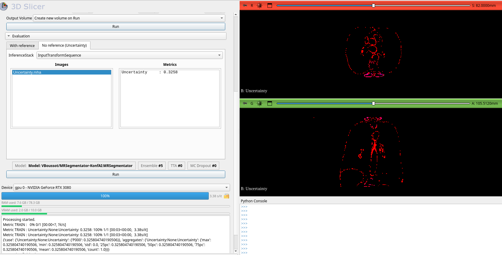
  </a>
  <figcaption>
    <span class="kf-visual-copy">
      <strong>Reference-free uncertainty is part of the same App.</strong>
      <span class="kf-visual-meta">MRSegmentator · ensemble sampling · uncertainty map and summary metric returned to Slicer</span>
    </span>
    <a class="kf-visual-inspect" href="../_static/slicer/uncertainty.png">Inspect 1676 × 852 <span aria-hidden="true">↗</span></a>
  </figcaption>
</figure>

When a reference exists, evaluation selects output/reference/mask nodes, runs
the App's configured metrics, and returns both numeric values and inspectable
error maps:

<figure class="kf-visual kf-visual--app">
  <a class="kf-visual-frame" href="../_static/slicer/evaluation.png" aria-label="Open the SlicerKonfAI evaluation screenshot at full resolution">
    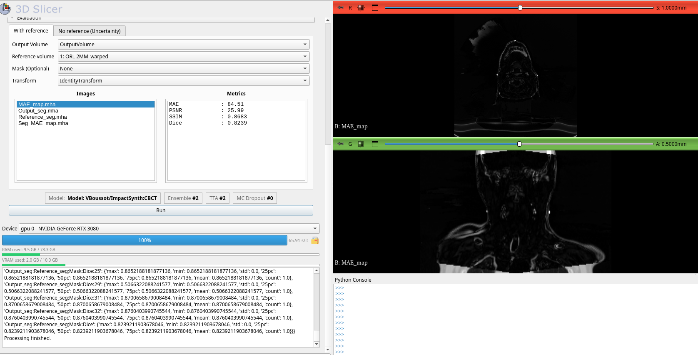
  </a>
  <figcaption>
    <span class="kf-visual-copy">
      <strong>Evaluation returns both numbers and inspectable error maps.</strong>
      <span class="kf-visual-meta">ImpactSynth shown case · MAE, PSNR, SSIM, Dice, image outputs, and per-case logs</span>
    </span>
    <a class="kf-visual-inspect" href="../_static/slicer/evaluation.png">Inspect 1676 × 852 <span aria-hidden="true">↗</span></a>
  </figcaption>
</figure>

Screenshots are vendored from
[`vboussot/SlicerKonfAI`](https://github.com/vboussot/SlicerKonfAI) at commit
`4508683`, under that repository's Apache-2.0 license. They demonstrate the
actual GUI contract at that revision; controls may evolve in later releases.

## Next steps

- {doc}`../reference/cli` — the full flag reference for `konfai-apps` and `konfai-apps-server`
- {doc}`../reference/python-api` — the `KonfAIApp` / `KonfAIAppClient` Python API and the trust model
- {doc}`../reference/app-server-api` — the HTTP endpoint contract of the server
