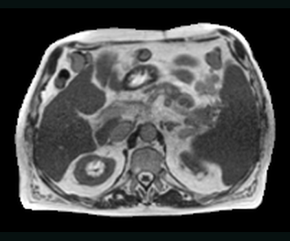
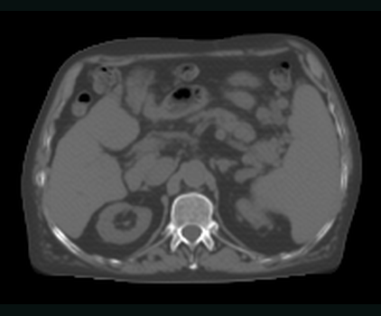
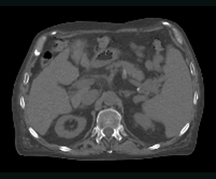
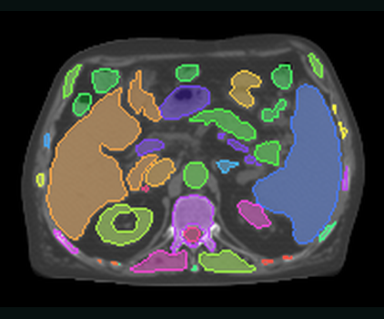
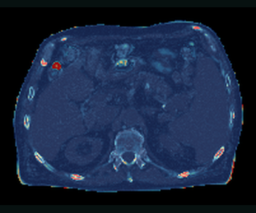
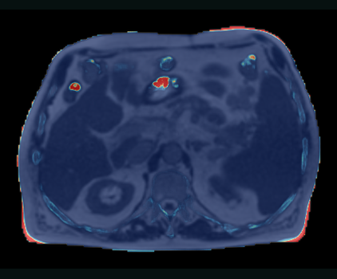
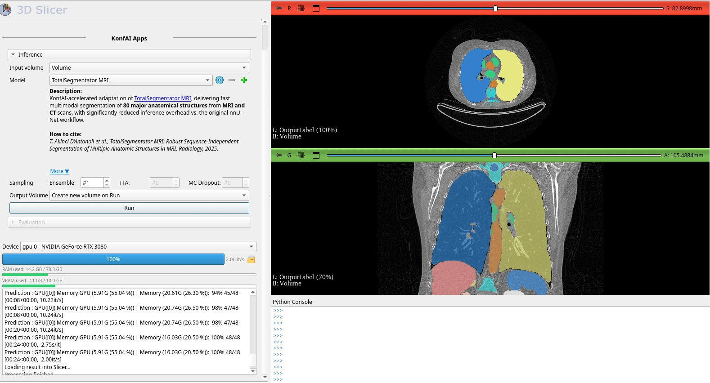
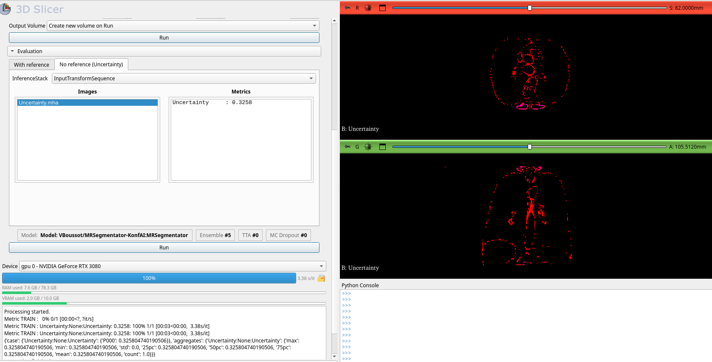
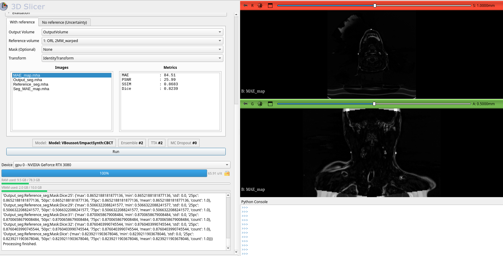

# Using KonfAI Apps

One command runs a published medical model on your data:

```bash
konfai-apps infer VBoussot/ImpactSynth:CBCT -i input.mha -o ./Output --gpu 0
```

No YAML, no training, no download step. The app carries its weights, its
preprocessing, its reconstruction and its evaluation, so the result comes back on
your input's geometry, ready to open.

```{warning}
Resolving an app **copies and imports its `.py` files**, so it runs arbitrary
code, and it pip-installs its `requirements.txt` by default
(`KONFAI_APPS_INSTALL_REQUIREMENTS=0` opts out). Only run apps from sources you
trust.
```

## What ships today

These are full medical models, not demonstrations. Every figure is measured on an
NVIDIA RTX PRO 5000 24 GB and quoted from the bundle's own README; the rows are
not comparable to each other, since the tasks, inputs and ensemble sizes differ.

| App | Workload | Measured |
| --- | --- | --- |
| `TotalSegmentator-KonfAI` | CT → 117 labels (`total`: 5 models, `total-3mm`: 1), MRI → 50 labels (`total_mr`: 2, `total_mr-3mm`: 1) | 42 s, 20 GB VRAM, 19 GB RAM on a 295 × 259 × 219 case. Head to head on 533 × 390 × 177: **17 s / 6.5 GB RAM** against the original's 61 s / 26.5 GB |
| `MRSegmentator-KonfAI:MRSegmentator` | MRI → 40 labels, five-fold ensemble | 27 s and 22 GB VRAM. Head to head on 533 × 390 × 177: **25 s / 7.5 GB RAM** against 65 s / 14.6 GB |
| `ImpactSeg:body` | one CT/MR/CBCT model → 11 structures | 7 s, 10 GB VRAM, 1.6 GB RAM |
| `ImpactSynth` | three MR/CBCT→sCT variants, five models each | 24 s and 16 GB VRAM for one inference, 82 s for the full ensemble, 2 GB RAM |
| `ImpactReg:ConvexAdam_Composite` | fixed + moving → moved image and displacement field on the fixed grid | 5.1 s and 2.1 GB VRAM on a real abdominal MR→CT pair |

Between them: four TotalSegmentator tasks, a five-fold MRSegmentator, one
modality-agnostic ImpactSeg model, three ImpactSynth variants and thirteen
IMPACT-Reg presets. Each ships as a runnable notebook that fetches a demo case
and plots the result, which is the fastest way to see what one produces: see
{doc}`../examples/index`.

### One real case, end to end

SynthRAD 2025 Task 1 abdomen case `1ABB124`, de-identified, CC BY-NC 4.0, with
hashes in the <a href="../_static/apps/ASSET_PROVENANCE.md">asset provenance
manifest</a>. ImpactSynth ran five checkpoints and two test-time augmentations
over the MR; the full TotalSegmentator app then ran its five checkpoints on the
resulting synthetic CT; KonfAI ran the evaluation and uncertainty workflows on
top. Every panel is a real output on the same physical plane, and the headline
values come from the per-case metric JSON.

<ul class="kf-example-grid kf-example-grid--compact" aria-label="Completed real-data KonfAI App workflow stages">
  <li><figure class="kf-example-card"><a class="kf-example-media" href="../_static/apps/impact-synth/mr-input.png" aria-label="Open the real abdominal MR input"></a><figcaption><span class="kf-example-step">01 · INPUT</span><strong>MR input</strong><span>One extracted plane from the paired abdominal case.</span><span class="kf-example-stats">Z +18 MM · 2 MM GRID</span></figcaption></figure></li>
  <li><figure class="kf-example-card"><a class="kf-example-media" href="../_static/apps/impact-synth/synthetic-ct.png" aria-label="Open the real ImpactSynth synthetic CT"></a><figcaption><span class="kf-example-step">02 · PREDICTION</span><strong>ImpactSynth sCT</strong><span>Five checkpoints over the original MR and two TTA states.</span><span class="kf-example-stats">15 INFERENCE STATES</span></figcaption></figure></li>
  <li><figure class="kf-example-card"><a class="kf-example-media" href="../_static/apps/impact-synth/reference-ct.png" aria-label="Open the paired real CT reference"></a><figcaption><span class="kf-example-step">03 · REFERENCE</span><strong>Paired CT</strong><span>The real target stays separate from the generated image.</span><span class="kf-example-stats">SAME PHYSICAL PLANE · 2 MM GRID</span></figcaption></figure></li>
  <li><figure class="kf-example-card"><a class="kf-example-media" href="../_static/apps/impact-synth/totalsegmentator.png" aria-label="Open the real TotalSegmentator anatomy output"></a><figcaption><span class="kf-example-step">04 · DOWNSTREAM APP</span><strong>Total anatomy</strong><span>The full TotalSegmentator ensemble runs directly on the sCT artifact.</span><span class="kf-example-stats">FULL TOTAL OVERLAY · 5 MODELS</span></figcaption></figure></li>
  <li><figure class="kf-example-card"><a class="kf-example-media" href="../_static/apps/impact-synth/mae-map.png" aria-label="Open the real ImpactSynth evaluation map"></a><figcaption><span class="kf-example-step">05 · EVALUATION</span><strong>Absolute-error map</strong><span>Display range 0–438.20 HU (P99); case scores use the complete metric volume.</span><span class="kf-example-stats">MAE 22.94 HU · PSNR 34.16 DB · SSIM 0.913</span></figcaption></figure></li>
  <li><figure class="kf-example-card"><a class="kf-example-media" href="../_static/apps/impact-synth/uncertainty-map.png" aria-label="Open the real ImpactSynth uncertainty map"></a><figcaption><span class="kf-example-step">06 · UNCERTAINTY</span><strong>Ensemble uncertainty</strong><span>Display range 0–4520.81% of baseline (P99) across the 15 states.</span><span class="kf-example-stats">MEAN 109.61% BASELINE · DISAGREEMENT 0.016</span></figcaption></figure></li>
</ul>

## Running one

An app exposes four operations, all on the same package:

```bash
konfai-apps infer       APP -i input.mha -o ./Output --gpu 0
konfai-apps eval        APP -i prediction.mha --gt ct.mha --mask mask.mha
konfai-apps uncertainty APP -i input.mha -o ./Output
konfai-apps pipeline    APP -i input.mha --gt ct.mha -o ./Output -uncertainty
```

`pipeline` chains inference, evaluation and uncertainty in one call. What each
family returns:

| Family | Input | Result | Also available |
| --- | --- | --- | --- |
| Segmentation | CT, MR or CBCT | label map on the input grid | Dice evaluation, ensemble/TTA uncertainty |
| Synthesis | MR or CBCT | synthetic CT with the reference geometry | masked MAE/SSIM evaluation, uncertainty |
| Registration | fixed + moving | moved image, displacement field, transform | image, label and landmark evaluation, field spread |

An app identifier is a local directory or a Hugging Face reference,
`owner/repository:variant`, optionally pinned to a revision with
`owner/repository@rev:variant`. For example `VBoussot/ImpactSynth:MR`,
`VBoussot/TotalSegmentator-KonfAI:total`.

Repeat `-i` / `--inputs` to pass several input groups, which is how an app that
expects an image plus a mask, or several files per group, receives them. The same
operations are available from Python through `konfai_apps.KonfAIApp`.

### Registration

IMPACT-Reg packages thirteen presets: rigid, rigid plus B-spline,
modality-specific MR/CT and CBCT/CT semantic presets, native ConvexAdam stages
and FireANTs presets. A preset writes `Moved.mha` and `DVF.mha`, the moved image and
the displacement field, on the fixed grid (the groups are named `MovedImage` and
`DisplacementField`). The orchestrator can ensemble several presets, write a
reusable transform, evaluate against images, labels or landmarks, and derive a
voxel-wise spread map from the ensemble.

```bash
impact-reg-konfai register MR_CT_MRSeg MR_CT_TS \
  -f fixed_ct.mha -m moving_mr.mha \
  --uncertainty -o ./Registration --gpu 0
```

<ul class="kf-example-grid kf-example-grid--registration" aria-label="Completed real-data IMPACT-Reg stages">
  <li><figure class="kf-example-card"><a class="kf-example-media" href="../_static/apps/impact-reg/moving-before.png" aria-label="Open the real moving MR before registration"></a><figcaption><span class="kf-example-step">01 · MOVING INPUT</span><strong>Moving MR: before</strong><span>Fixed-CT contours expose the controlled metadata-only offset.</span><span class="kf-example-stats">NCC 0.129 · MAE 106.11</span></figcaption></figure></li>
  <li><figure class="kf-example-card"><a class="kf-example-media" href="../_static/apps/impact-reg/fixed-ct.png" aria-label="Open the real fixed CT target"></a><figcaption><span class="kf-example-step">02 · FIXED REFERENCE</span><strong>Fixed CT target</strong><span>The reference image defines the physical output grid.</span><span class="kf-example-stats">222 × 226 × 124 · 2 MM GRID</span></figcaption></figure></li>
  <li><figure class="kf-example-card"><a class="kf-example-media" href="../_static/apps/impact-reg/moved-after.png" aria-label="Open the real moved MR after registration"></a><figcaption><span class="kf-example-step">03 · MOVED OUTPUT</span><strong>Moved MR: after</strong><span><code>ConvexAdam_Composite</code> writes the result on the fixed grid.</span><span class="kf-example-stats">NCC 0.937 · MAE 21.09</span></figcaption></figure></li>
  <li><figure class="kf-example-card"><a class="kf-example-media" href="../_static/apps/impact-reg/displacement-field.png" aria-label="Open the real physical displacement field"></a><figcaption><span class="kf-example-step">04 · PHYSICAL FIELD</span><strong>Displacement field</strong><span>Three physical components in millimetres, with sampled vectors.</span><span class="kf-example-stats">MEAN 23.06 MM · P95 25.55 MM</span></figcaption></figure></li>
</ul>

### Fine-tuning

```bash
konfai-apps fine-tune APP NAME -d ./Dataset --epochs 10 --gpu 0
konfai-apps fine-tune APP NAME -d ./Dataset --models CV_0 CV_1 --epochs 10 --gpu 0
```

The app installs its training assets, links your dataset, then restarts training
from each selected checkpoint's pretrained weights with a fresh optimizer,
schedule and epoch counter, so `--epochs` epochs really run. `--models` picks
which checkpoints, defaulting to the first; each is fine-tuned independently. The
output is another app bundle, ready to run.

## Running on another machine

Any command becomes remote when you pass `--host`. The CLI is unchanged; the
client uploads the inputs, schedules the job, streams the logs over SSE and
downloads the result. Server side, jobs queue, get a GPU, run in an isolated
workspace and are cleaned up after a grace period.

```bash
export KONFAI_API_TOKEN="my-secret-token"
konfai-apps-server --host 0.0.0.0 --port 8000 --apps konfai-apps/tests/assets/apps.json

konfai-apps infer VBoussot/ImpactSynth:CBCT -i input.mha -o ./Output \
  --host my.server.org --port 8000 --token "$KONFAI_API_TOKEN"
```

Bearer authentication is on by default: without a token the server exits before
binding rather than serving unauthenticated. `--auth off` drops it deliberately,
`--token` supplies one inline for development. The HTTP contract behind all this,
health, device and app metadata, job status, log, result and kill, is in
{doc}`../reference/app-server-api`.

## From 3D Slicer

[SlicerKonfAI](https://github.com/vboussot/SlicerKonfAI) is the external Slicer
client. It lists apps, maps Slicer volumes onto their declared inputs, launches
locally or remotely, and loads the returned volumes and segmentations back into
the scene.

Slicer is another client of a validated app, not a separate package: test the
bundle with `konfai-apps infer` first, then use the same identifier there. The
integration is external and its progress contract is less stable than the Python
API, so pin compatible versions for clinical-facing installs.

<figure class="kf-visual kf-visual--app">
  <a class="kf-visual-frame" href="../_static/slicer/inference.webp" aria-label="Open the SlicerKonfAI inference screenshot at full resolution">
    
  </a>
  <figcaption>
    <span class="kf-visual-copy">
      <strong>Inference stays inside the clinical imaging workspace.</strong>
      <span class="kf-visual-meta">TotalSegmentator MRI · App selection, sampling controls, live logs, and returned segmentation</span>
    </span>
    <a class="kf-visual-inspect" href="../_static/slicer/inference.webp">Inspect 1578 × 852 <span aria-hidden="true">↗</span></a>
  </figcaption>
</figure>

<figure class="kf-visual kf-visual--app">
  <a class="kf-visual-frame" href="../_static/slicer/uncertainty.png" aria-label="Open the SlicerKonfAI uncertainty screenshot at full resolution">
    
  </a>
  <figcaption>
    <span class="kf-visual-copy">
      <strong>Reference-free uncertainty is part of the same App.</strong>
      <span class="kf-visual-meta">MRSegmentator · ensemble sampling · uncertainty map and summary metric returned to Slicer</span>
    </span>
    <a class="kf-visual-inspect" href="../_static/slicer/uncertainty.png">Inspect 1676 × 852 <span aria-hidden="true">↗</span></a>
  </figcaption>
</figure>

<figure class="kf-visual kf-visual--app">
  <a class="kf-visual-frame" href="../_static/slicer/evaluation.png" aria-label="Open the SlicerKonfAI evaluation screenshot at full resolution">
    
  </a>
  <figcaption>
    <span class="kf-visual-copy">
      <strong>Evaluation returns both numbers and inspectable error maps.</strong>
      <span class="kf-visual-meta">ImpactSynth shown case · MAE, PSNR, SSIM, Dice, image outputs, and per-case logs</span>
    </span>
    <a class="kf-visual-inspect" href="../_static/slicer/evaluation.png">Inspect 1676 × 852 <span aria-hidden="true">↗</span></a>
  </figcaption>
</figure>

Screenshots vendored from
[`vboussot/SlicerKonfAI`](https://github.com/vboussot/SlicerKonfAI) at commit
`4508683`, under that repository's Apache-2.0 license.

## Packaging your own workflow

Once a workflow is stable, `bundle` is the handoff. It validates the metadata,
copies the prediction and evaluation configs and the checkpoints, includes custom
Python when needed, and writes the layout every resolver understands.

An app is recognized by its `app.json`:

```json
{
  "display_name": "My segmentation model",
  "description": "Segments the target anatomy from CT.",
  "short_description": "CT segmentation",
  "tta": 0,
  "mc_dropout": 0
}
```

```bash
konfai-apps bundle CT_SEG \
  --out dist \
  --app-json app.json \
  --config Prediction.yml Evaluation.yml \
  --checkpoint Checkpoints/SEG_BASELINE/*.pt \
  --model-py Model.py
```

That writes `dist/CT_SEG/`, containing `app.json`, the configs, the checkpoints
and any custom Python. `app.json.models` is filled from the checkpoint filenames
when you omit it, and a missing `requirements.txt` is drafted from `Model.py`'s
imports: review that draft, it is a convenience rather than an environment lock.
Omit `--model-py` when the workflow uses no custom Python, and add `Uncertainty.yml`
to `--config` when the app should expose an uncertainty workflow. `--onnx` exports
an ONNX graph beside the checkpoints, which is experimental and not needed for
normal execution.

Validate before publishing, and look at the images rather than the exit code:

```bash
konfai-apps infer ./dist/CT_SEG -i input.mha -o ./Output --gpu 0
konfai-apps eval ./dist/CT_SEG -i ./Output/<prediction>.mha --gt reference.mha
```

Once local inference matches the research workflow, upload `CT_SEG/` as a variant
in a Hugging Face model repository and address it as `owner/repository:CT_SEG`.

The YAML stays inside the bundle as the inspectable record, which is what lets
the same app be evaluated, fine-tuned, served or automated later instead of being
replaced by a deployment script.

## Next steps

- {doc}`../reference/cli`: every flag of `konfai-apps` and `konfai-apps-server`.
- {doc}`../reference/python-api`: the `KonfAIApp` and `KonfAIAppClient` API.
- {doc}`../reference/app-server-api`: the server's HTTP contract.
