# Using KonfAI Apps

One command runs a published medical model on your data:

```bash
konfai-apps infer VBoussot/ImpactSynth:CBCT -i input.mha -o ./Output --gpu 0
```

No YAML, no training, no download step. The app carries its weights, its
preprocessing, its reconstruction and its evaluation, so the result comes back on
your input's geometry, ready to open.

```{warning}
Resolving an app **copies and imports its `.py` files**, so it runs arbitrary
code, and it pip-installs its `requirements.txt` by default
(`KONFAI_APPS_INSTALL_REQUIREMENTS=0` opts out). Only run apps from sources you
trust.
```

## What ships today

These are full medical models, not demonstrations. Every figure is the medium case
(249 × 246 × 246) of the bundle's own README table, measured with
`benchmarks/perf/bench_apps.py` on an NVIDIA RTX PRO 5000 24 GB on 2026-09-09; the
rows are not comparable to each other, since the tasks and ensemble sizes differ.

| App | Workload | Measured |
| --- | --- | --- |
| `TotalSegmentator-KonfAI` | CT → 117 labels (`total`: 5 models, `total-3mm`: 1), MRI → 50 labels (`total_mr`: 2, `total_mr-3mm`: 1) | **17.7 s / 5.2 GB RAM**, 15.4 GB VRAM, against the original's 58.3 s / 25.2 GB RAM |
| `MRSegmentator-KonfAI:MRSegmentator` | MRI → 40 labels, five-fold ensemble | **21 s / 5.3 GB RAM**, 16.3 GB VRAM, against the original's 24 s / 8.5 GB RAM |
| `ImpactSeg:body` | one CT/MR/CBCT model → 11 structures | 3.3 s, 1.7 GB RAM, 3.9 GB VRAM |
| `ImpactSynth` | three MR/CBCT→sCT variants, five models each | `MR`: 24.6 s, 2.7 GB RAM, 12.8 GB VRAM |
| `ImpactReg:FireANTs_SyN` | fixed + moving → moved image and displacement field on the fixed grid | 108 s, 6.3 GB RAM, 16.0 GB VRAM |

Between them: four TotalSegmentator tasks, a five-fold MRSegmentator, one
modality-agnostic ImpactSeg model, three ImpactSynth variants and thirteen
IMPACT-Reg presets. Each ships as a runnable notebook that fetches a demo case
and plots the result, which is the fastest way to see what one produces: see
{doc}`../examples/index`.

### The command each ships

| App CLI | Task | Modality | Models |
| --- | --- | --- | --- |
| `impact-synth-konfai synthesize` | Synthetic CT (sCT) | MR → CT, CBCT → CT | `MR`, `CBCT`, `MR_CBCT` |
| `impact-seg-konfai segment` | Multimodal body segmentation (11 labels) | CBCT / MR / CT | `body` |
| `mrsegmentator-konfai segment` | Whole-body MRI segmentation | MRI | folds 1–5 |
| `totalsegmentator-konfai segment` | Whole-body CT/MRI segmentation | CT / MRI | `total`, `total_mr`, 3 mm variants |
| `impact-reg-konfai register` | Multimodal deformable registration | MR/CT, CBCT/CT | presets |

Each also exposes `eval` and (except TotalSegmentator) `uncertainty`; the thin
wrappers add `pipeline`. See {doc}`../usage/apps` for how to run them and
{doc}`../reference/cli` for the full flag reference.

### One real case, end to end

SynthRAD 2025 Task 1 abdomen case `1ABB124`, de-identified, CC BY-NC 4.0, with
hashes in the <a href="../_static/apps/ASSET_PROVENANCE.md">asset provenance
manifest</a>. ImpactSynth ran five checkpoints and two test-time augmentations
over the MR; the full TotalSegmentator app then ran its five checkpoints on the
resulting synthetic CT; KonfAI ran the evaluation and uncertainty workflows on
top. Every panel is a real output on the same physical plane, and the headline
values come from the per-case metric JSON.

<ul class="kf-example-grid kf-example-grid--compact" aria-label="Completed real-data KonfAI App workflow stages">
  <li><figure class="kf-example-card"><a class="kf-example-media" href="../_static/apps/impact-synth/mr-input.png" aria-label="Open the real abdominal MR input">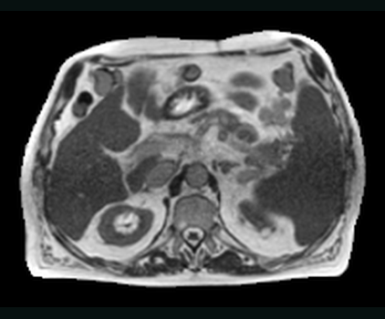</a><figcaption><span class="kf-example-step">01 · INPUT</span><strong>MR input</strong><span>One extracted plane from the paired abdominal case.</span><span class="kf-example-stats">Z +18 MM · 2 MM GRID</span></figcaption></figure></li>
  <li><figure class="kf-example-card"><a class="kf-example-media" href="../_static/apps/impact-synth/synthetic-ct.png" aria-label="Open the real ImpactSynth synthetic CT">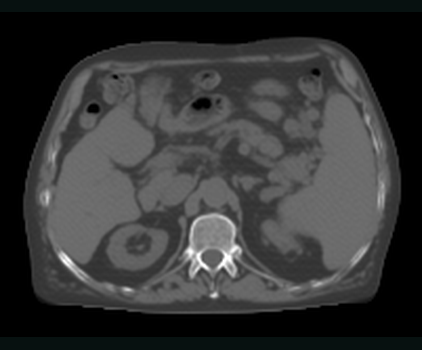</a><figcaption><span class="kf-example-step">02 · PREDICTION</span><strong>ImpactSynth sCT</strong><span>Five checkpoints over the original MR and two TTA states.</span><span class="kf-example-stats">15 INFERENCE STATES</span></figcaption></figure></li>
  <li><figure class="kf-example-card"><a class="kf-example-media" href="../_static/apps/impact-synth/reference-ct.png" aria-label="Open the paired real CT reference">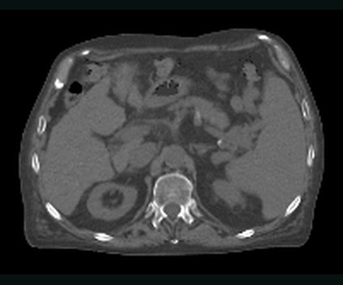</a><figcaption><span class="kf-example-step">03 · REFERENCE</span><strong>Paired CT</strong><span>The real target stays separate from the generated image.</span><span class="kf-example-stats">SAME PHYSICAL PLANE · 2 MM GRID</span></figcaption></figure></li>
  <li><figure class="kf-example-card"><a class="kf-example-media" href="../_static/apps/impact-synth/totalsegmentator.png" aria-label="Open the real TotalSegmentator anatomy output">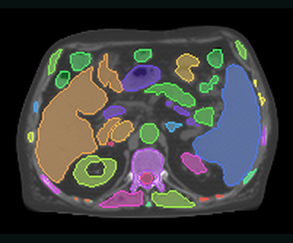</a><figcaption><span class="kf-example-step">04 · DOWNSTREAM APP</span><strong>Total anatomy</strong><span>The full TotalSegmentator ensemble runs directly on the sCT artifact.</span><span class="kf-example-stats">FULL TOTAL OVERLAY · 5 MODELS</span></figcaption></figure></li>
  <li><figure class="kf-example-card"><a class="kf-example-media" href="../_static/apps/impact-synth/mae-map.png" aria-label="Open the real ImpactSynth evaluation map">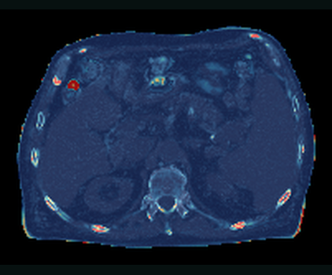</a><figcaption><span class="kf-example-step">05 · EVALUATION</span><strong>Absolute-error map</strong><span>Display range 0–438.20 HU (P99); case scores use the complete metric volume.</span><span class="kf-example-stats">MAE 22.94 HU · PSNR 34.16 DB · SSIM 0.913</span></figcaption></figure></li>
  <li><figure class="kf-example-card"><a class="kf-example-media" href="../_static/apps/impact-synth/uncertainty-map.png" aria-label="Open the real ImpactSynth uncertainty map">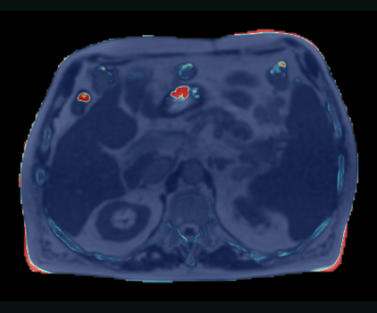</a><figcaption><span class="kf-example-step">06 · UNCERTAINTY</span><strong>Ensemble uncertainty</strong><span>Display range 0–4520.81% of baseline (P99) across the 15 states.</span><span class="kf-example-stats">MEAN 109.61% BASELINE · DISAGREEMENT 0.016</span></figcaption></figure></li>
</ul>

## Running one

An app exposes four operations, all on the same package:

```bash
konfai-apps infer       APP -i input.mha -o ./Output --gpu 0
konfai-apps eval        APP -i prediction.mha --gt ct.mha --mask mask.mha
konfai-apps uncertainty APP -i input.mha -o ./Output
konfai-apps pipeline    APP -i input.mha --gt ct.mha -o ./Output -uncertainty
```

`pipeline` chains inference, evaluation and uncertainty in one call. What each
family returns:

| Family | Input | Result | Also available |
| --- | --- | --- | --- |
| Segmentation | CT, MR or CBCT | label map on the input grid | Dice evaluation, ensemble/TTA uncertainty |
| Synthesis | MR or CBCT | synthetic CT with the reference geometry | masked MAE/SSIM evaluation, uncertainty |
| Registration | fixed + moving | moved image, displacement field, transform | image, label and landmark evaluation, field spread |

An app identifier is a local directory or a Hugging Face reference,
`owner/repository:variant`, optionally pinned to a revision with
`owner/repository@rev:variant`. For example `VBoussot/ImpactSynth:MR`,
`VBoussot/TotalSegmentator-KonfAI:total`. Without `@rev`, a konfai-apps release
takes the revision tagged with its own version (`v1.9.0`) when the repository has
it, and `main` otherwise, so each release runs the configs made for it. Whether a
repository has that tag is asked once and kept until a refresh (a tag already
downloaded counts too). A run waits at most 3 seconds for the answer and keeps
`main` for the rest of the process if none came. A run asks again for a tag not
downloaded yet, unless a listing of the process has just read it, and takes `main`
when the Hub does not answer and `main` is here. A listing never waits for it: it
lists `main` until the answer is known, and the next listing reads the tagged
revision. Offline, only a tag already downloaded counts.

The apps of a repository, as the Studio catalogue, `list_apps` in the MCP server
and the Slicer app list show them, are read from the Hub once per machine:

- The first time a machine lists a repository, its file list is read in one
  call and waited for at most 3 seconds, and the files of every app except the
  checkpoints (manifest, icon, configs) are then downloaded together in the
  background; the summaries wait for them until the same 3 seconds are up, and
  an app whose files are not there yet is listed without its summary. The
  repositories of one listing are read together, so they share that wait, and
  once a Hub call of the process has gone 3 seconds without an answer, the next
  ones are not waited for: a Hub that does not answer holds a process once. A
  repository not read in time is listed from the local Hugging Face cache; with
  nothing there, the Slicer app list and the `konfai-apps` commands wait for the
  Hub, and `list_apps` reports the repository as not listed yet. A process that
  ends first (Studio starts the MCP server for each call) leaves the rest to the
  next listing, which keeps the files already downloaded.
- Afterwards the listing and each app's summary (name, description, inputs and
  outputs, task, fine-tuning, patch size, icon) come from what was kept under
  `~/.cache/huggingface/assets/konfai-apps` and from the Hugging Face cache,
  with no network call. A download that brings a newer commit of the
  repository makes the next listing read it again. A release tag whose files
  are not here yet is read the same way as a repository never listed; when it
  cannot be read (`list_apps` waits 3 seconds for it), `main` is listed if `main`
  is here. Studio shows an app's icon once the catalogue has downloaded it, and
  never waits for the Hub for it.
- A refresh reads the Hub again, release tag included, and waits for it:
  `list_apps` or `describe_app` with `force_update`, the refresh of the Slicer
  app list, `--force_update` on the `konfai-apps` commands.
- Offline (`HF_HUB_OFFLINE=1`) nothing goes to the network: the listing uses
  what was kept, or else the apps the local Hugging Face cache holds.

`konfai-apps download` and an app export take every file of the app,
checkpoints included, even the ones not downloaded yet.

Repeat `-i` / `--inputs` to pass several input groups, which is how an app that
expects an image plus a mask, or several files per group, receives them. The same
operations are available from Python through `konfai_apps.KonfAIApp`.

### Registration

IMPACT-Reg packages thirteen presets: rigid, rigid plus B-spline,
modality-specific MR/CT and CBCT/CT semantic presets, native ConvexAdam stages
and FireANTs presets. A preset writes `Moved.mha` and `DVF.mha`, the moved image and
the displacement field, on the fixed grid (the groups are named `MovedImage` and
`DisplacementField`). The orchestrator can ensemble several presets, write a
reusable transform, evaluate against images, labels or landmarks, and derive a
voxel-wise spread map from the ensemble.

```bash
impact-reg-konfai register MR_CT_MRSeg MR_CT_TS \
  -f fixed_ct.mha -m moving_mr.mha \
  --uncertainty -o ./Registration --gpu 0
```

<ul class="kf-example-grid kf-example-grid--registration" aria-label="Completed real-data IMPACT-Reg stages">
  <li><figure class="kf-example-card"><a class="kf-example-media" href="../_static/apps/impact-reg/moving-before.png" aria-label="Open the real moving MR before registration"></a><figcaption><span class="kf-example-step">01 · MOVING INPUT</span><strong>Moving MR: before</strong><span>Fixed-CT contours expose the controlled metadata-only offset.</span><span class="kf-example-stats">NCC 0.129 · MAE 106.11</span></figcaption></figure></li>
  <li><figure class="kf-example-card"><a class="kf-example-media" href="../_static/apps/impact-reg/fixed-ct.png" aria-label="Open the real fixed CT target">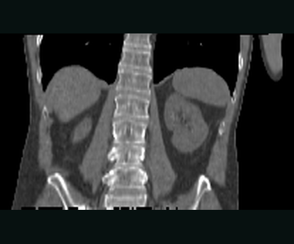</a><figcaption><span class="kf-example-step">02 · FIXED REFERENCE</span><strong>Fixed CT target</strong><span>The reference image defines the physical output grid.</span><span class="kf-example-stats">222 × 226 × 124 · 2 MM GRID</span></figcaption></figure></li>
  <li><figure class="kf-example-card"><a class="kf-example-media" href="../_static/apps/impact-reg/moved-after.png" aria-label="Open the real moved MR after registration"></a><figcaption><span class="kf-example-step">03 · MOVED OUTPUT</span><strong>Moved MR: after</strong><span><code>ConvexAdam_Composite</code> writes the result on the fixed grid.</span><span class="kf-example-stats">NCC 0.937 · MAE 21.09</span></figcaption></figure></li>
  <li><figure class="kf-example-card"><a class="kf-example-media" href="../_static/apps/impact-reg/displacement-field.png" aria-label="Open the real physical displacement field">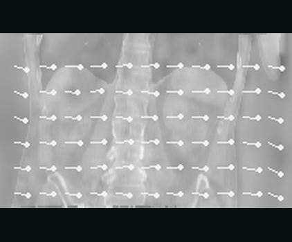</a><figcaption><span class="kf-example-step">04 · PHYSICAL FIELD</span><strong>Displacement field</strong><span>Three physical components in millimetres, with sampled vectors.</span><span class="kf-example-stats">MEAN 23.06 MM · P95 25.55 MM</span></figcaption></figure></li>
</ul>

### Fine-tuning

```bash
konfai-apps fine-tune APP NAME -d ./Dataset --epochs 10 --gpu 0
konfai-apps fine-tune APP NAME -d ./Dataset --models CV_0 CV_1 --epochs 10 --gpu 0
```

The app installs its training assets, links your dataset, then restarts training
from each selected checkpoint's pretrained weights with a fresh optimizer,
schedule and epoch counter, so `--epochs` epochs really run. `--models` picks
which checkpoints, defaulting to the first; each is fine-tuned independently. The
output is another app bundle, ready to run. The run works in its output directory
(`./Output` by default) and links your dataset there as `Dataset`, so an output
directory that already holds a `Dataset` of its own, such as a project root, is
refused and nothing is deleted.

## Running on another machine

Any command becomes remote when you pass `--host`. The CLI is unchanged; the
client uploads the inputs, schedules the job, streams the logs over SSE and
downloads the result. Server side, jobs queue, get a GPU, run in an isolated
workspace and are cleaned up after a grace period. The server comes with the
`server` extra (`pip install "konfai-apps[server]"`); the client needs nothing more.

```bash
echo '{"apps": ["VBoussot/ImpactSynth:CBCT"]}' > apps.json   # the apps the server exposes
export KONFAI_API_TOKEN="my-secret-token"
konfai-apps-server --host 0.0.0.0 --port 8000 --apps apps.json

konfai-apps infer VBoussot/ImpactSynth:CBCT -i input.mha -o ./Output \
  --host my.server.org --port 8000 --token "$KONFAI_API_TOKEN"
```

Bearer authentication is on by default: without a token the server exits before
binding rather than serving unauthenticated. `--auth off` drops it deliberately,
`--token` supplies one inline for development. The HTTP contract behind all this,
health, device and app metadata, job status, log, result and kill, is in
{doc}`../reference/app-server-api`.

## From 3D Slicer

[SlicerKonfAI](https://github.com/vboussot/SlicerKonfAI) is the external Slicer
client. It lists apps, maps Slicer volumes onto their declared inputs, launches
locally or remotely, and loads the returned volumes and segmentations back into
the scene.

Slicer is another client of a validated app, not a separate package: test the
bundle with `konfai-apps infer` first, then use the same identifier there. The
integration is external and its progress contract is less stable than the Python
API, so pin compatible versions for clinical-facing installs.

<figure class="kf-visual kf-visual--app">
  <a class="kf-visual-frame" href="../_static/slicer/inference.webp" aria-label="Open the SlicerKonfAI inference screenshot at full resolution">
    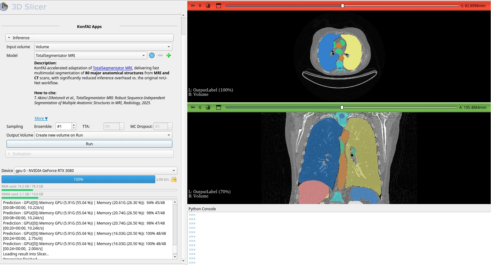
  </a>
  <figcaption>
    <span class="kf-visual-copy">
      <strong>Inference stays inside the clinical imaging workspace.</strong>
      <span class="kf-visual-meta">TotalSegmentator MRI · App selection, sampling controls, live logs, and returned segmentation</span>
    </span>
    <a class="kf-visual-inspect" href="../_static/slicer/inference.webp">Inspect 1578 × 852 <span aria-hidden="true">↗</span></a>
  </figcaption>
</figure>

<figure class="kf-visual kf-visual--app">
  <a class="kf-visual-frame" href="../_static/slicer/uncertainty.png" aria-label="Open the SlicerKonfAI uncertainty screenshot at full resolution">
    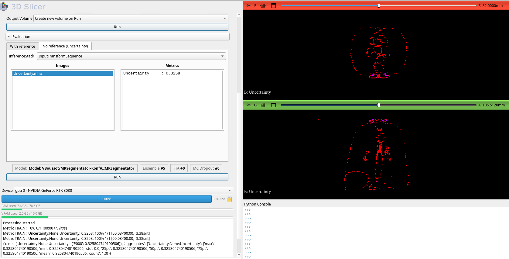
  </a>
  <figcaption>
    <span class="kf-visual-copy">
      <strong>Reference-free uncertainty is part of the same App.</strong>
      <span class="kf-visual-meta">MRSegmentator · ensemble sampling · uncertainty map and summary metric returned to Slicer</span>
    </span>
    <a class="kf-visual-inspect" href="../_static/slicer/uncertainty.png">Inspect 1676 × 852 <span aria-hidden="true">↗</span></a>
  </figcaption>
</figure>

<figure class="kf-visual kf-visual--app">
  <a class="kf-visual-frame" href="../_static/slicer/evaluation.png" aria-label="Open the SlicerKonfAI evaluation screenshot at full resolution">
    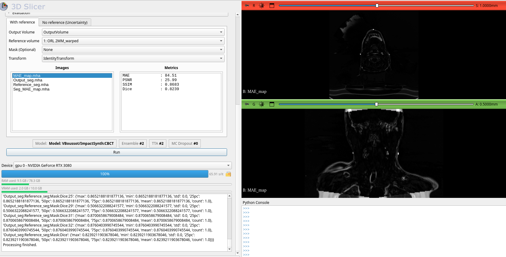
  </a>
  <figcaption>
    <span class="kf-visual-copy">
      <strong>Evaluation returns both numbers and inspectable error maps.</strong>
      <span class="kf-visual-meta">ImpactSynth shown case · MAE, PSNR, SSIM, Dice, image outputs, and per-case logs</span>
    </span>
    <a class="kf-visual-inspect" href="../_static/slicer/evaluation.png">Inspect 1676 × 852 <span aria-hidden="true">↗</span></a>
  </figcaption>
</figure>

Screenshots vendored from
[`vboussot/SlicerKonfAI`](https://github.com/vboussot/SlicerKonfAI) at commit
`4508683`, under that repository's Apache-2.0 license.

## Packaging your own workflow

Once a workflow is stable, `bundle` is the handoff. It validates the metadata,
copies the prediction and evaluation configs and the checkpoints, includes custom
Python when needed, and writes the layout every resolver understands.

An app is recognized by its `app.json`:

```json
{
  "display_name": "My segmentation model",
  "description": "Segments the target anatomy from CT.",
  "short_description": "CT segmentation",
  "tta": 0,
  "mc_dropout": 0
}
```

```bash
konfai-apps bundle CT_SEG \
  --out dist \
  --app-json app.json \
  --config Prediction.yml Evaluation.yml \
  --checkpoint Checkpoints/SEG_BASELINE/[0-9]*.pt \
  --model-py Model.py
```

That writes `dist/CT_SEG/`, containing `app.json`, the configs, the checkpoints
and any custom Python. `app.json.models` is filled from the checkpoint filenames
when you omit it, and a missing `requirements.txt` is drafted from `Model.py`'s
imports: review that draft, it is a convenience rather than an environment lock.
Omit `--model-py` when the workflow uses no custom Python, and add `Uncertainty.yml`
to `--config` when the app should expose an uncertainty workflow. `--onnx` exports
an ONNX graph beside the checkpoints, which is experimental and not needed for
normal execution.

Validate before publishing, and look at the images rather than the exit code:

```bash
konfai-apps infer ./dist/CT_SEG -i input.mha -o ./Output --gpu 0
konfai-apps eval ./dist/CT_SEG -i ./Output/<prediction>.mha --gt reference.mha
```

Once local inference matches the research workflow, upload `CT_SEG/` as a variant
in a Hugging Face model repository and address it as `owner/repository:CT_SEG`.

The YAML stays inside the bundle as the inspectable record, which is what lets
the same app be evaluated, fine-tuned, served or automated later instead of being
replaced by a deployment script.

## The ecosystem around an app

KonfAI is the core, but several packages and tools sit around it. This map
shows how they relate and, more importantly, **what is shipped versus what is
external or experimental**, so you know what you can rely on today.

```{raw} html
<figure class="kf-ecosystem-map" aria-labelledby="kf-ecosystem-map-caption">
  <div class="kf-ecosystem-map__canvas">
    <div class="kf-ecosystem-map__topline">
      <span>KonfAI system map</span>
      <span class="kf-ecosystem-map__legend"><i></i> released path <i class="is-dashed"></i> experimental edge</span>
    </div>
    <p class="kf-sr-only">Resolved YAML and medical data enter the KonfAI core. KonfAI Apps and KonfAI MCP both build on the core; MCP also operates Apps. Hugging Face artifacts feed Apps and the task-specific command-line tools. Slicer clients operate Apps and ImpactReg, while ONNX to konfai-rs remains experimental.</p>
    <svg class="kf-ecosystem-map__routes" viewBox="0 0 1100 992" preserveAspectRatio="none" aria-hidden="true">
      <path class="route route--core" d="M290 148 C330 148 310 224 365 224" />
      <path class="route route--core" d="M550 418 V432 C550 446 292 434 292 448" />
      <path class="route route--core" d="M550 418 V432 C550 446 832 434 832 448" />
      <path class="route route--mcp" d="M478 515 H644" />
      <path class="route route--artifact" d="M930 193 V406 C930 438 462 420 462 448" />
      <path class="route route--artifact" d="M930 193 V606 C930 632 500 612 500 640" />
      <path class="route route--apps" d="M292 578 V620 C292 634 174 626 174 640" />
      <path class="route route--apps" d="M292 578 V620 C292 634 500 626 500 640" />
      <path class="route route--mcp" d="M832 626 V632 C832 638 925 632 925 640" />
      <path class="route route--external" d="M174 787 V800" />
      <path class="route route--external" d="M500 787 V800" />
      <path class="route route--experimental" d="M657 418 C690 540 925 650 925 800" />
      <g class="stations">
        <circle cx="365" cy="224" r="5" /><circle cx="292" cy="448" r="5" /><circle cx="832" cy="448" r="5" />
        <circle cx="462" cy="448" r="5" /><circle cx="500" cy="640" r="5" /><circle cx="174" cy="640" r="5" />
        <circle cx="925" cy="640" r="5" /><circle cx="174" cy="800" r="5" /><circle cx="500" cy="800" r="5" />
      </g>
    </svg>

    <div class="kf-ecosystem-map__node kf-ecosystem-map__node--input">
      <span class="kf-ecosystem-map__kind">Research contract</span>
      <strong>Resolved YAML + medical data</strong>
      <p>Data, transforms, models, losses, metrics, and workflow intent.</p>
    </div>

    <div class="kf-ecosystem-map__node kf-ecosystem-map__node--artifact">
      <span class="kf-ecosystem-map__kind">Published artifacts</span>
      <strong>Hugging Face Hub</strong>
      <p>App configs, checkpoints, metadata, and demo datasets.</p>
      <span class="kf-ecosystem-map__status">published</span>
    </div>

    <div class="kf-ecosystem-map__node kf-ecosystem-map__node--hub">
      <span class="kf-ecosystem-map__kind">Execution foundation · PyPI</span>
      <strong><code>konfai</code></strong>
      <p>One declarative, patch-native engine for medical-imaging workflows.</p>
      <div class="kf-ecosystem-map__commands" aria-label="Core workflows">
        <span>TRAIN</span><span>PREDICTION</span><span>EVALUATION</span>
      </div>
    </div>

    <div class="kf-ecosystem-map__node kf-ecosystem-map__node--apps">
      <span class="kf-ecosystem-map__kind">Application runtime · PyPI</span>
      <strong><code>konfai-apps</code></strong>
      <p>Resolve local or Hub Apps and run the same workflow through Python, CLI, REST, or SSE logs.</p>
    </div>

    <div class="kf-ecosystem-map__node kf-ecosystem-map__node--mcp">
      <span class="kf-ecosystem-map__kind">Agent runtime · PyPI</span>
      <strong><code>konfai-mcp</code></strong>
      <p>Operates core workflows and Apps through structured scientific tools.</p>
      <div class="kf-ecosystem-map__commands" aria-label="MCP transports">
        <span>STDIO</span><span>SSE</span><span>HTTP</span>
      </div>
    </div>

    <div class="kf-ecosystem-map__node kf-ecosystem-map__node--interfaces">
      <span class="kf-ecosystem-map__kind">App surfaces</span>
      <strong>Python · CLI · REST</strong>
      <p>Local and remote execution share one App contract.</p>
    </div>

    <div class="kf-ecosystem-map__node kf-ecosystem-map__node--tasks">
      <span class="kf-ecosystem-map__kind">Task CLIs · PyPI</span>
      <strong>Five ready-to-run entry points</strong>
      <p>ImpactSynth · ImpactSeg · ImpactReg · MRSegmentator · TotalSegmentator</p>
    </div>

    <div class="kf-ecosystem-map__node kf-ecosystem-map__node--agents">
      <span class="kf-ecosystem-map__kind">Agent clients</span>
      <strong>Scientific automation</strong>
      <p>Inspect, configure, validate, execute, compare, and resume.</p>
    </div>

    <div class="kf-ecosystem-map__node kf-ecosystem-map__node--slicer-apps">
      <span class="kf-ecosystem-map__kind">External clinical client</span>
      <strong>SlicerKonfAI</strong>
      <p>Runs KonfAI Apps from 3D Slicer.</p>
      <span class="kf-ecosystem-map__status">external</span>
    </div>

    <div class="kf-ecosystem-map__node kf-ecosystem-map__node--slicer-reg">
      <span class="kf-ecosystem-map__kind">External registration client</span>
      <strong>SlicerImpactReg</strong>
      <p>Drives the complete ImpactReg orchestrator.</p>
      <span class="kf-ecosystem-map__status">external</span>
    </div>

    <div class="kf-ecosystem-map__node kf-ecosystem-map__node--experimental">
      <span class="kf-ecosystem-map__kind">Portable edge</span>
      <strong>ONNX → <code>konfai-rs</code></strong>
      <p>Native and WebAssembly inference path.</p>
      <span class="kf-ecosystem-map__status">experimental</span>
    </div>
  </div>
  <figcaption id="kf-ecosystem-map-caption"><strong>One execution model, several operating surfaces.</strong> Solid routes show released dependencies and orchestration paths; the dotted route is experimental.</figcaption>
</figure>
```

### Released platform

| Piece | Status | What it is |
| --- | --- | --- |
| **`konfai`** | ✅ Shipped (PyPI) | The core framework: config-by-reflection, lazy patch-based data, model graphs, and the three YAML workflows. This is what the rest of this documentation is about. |
| **`konfai-apps`** | ✅ Shipped (PyPI, own CI) | Packages a mature workflow as a reusable **app**: see {doc}`../usage/apps`. |
| **`konfai-mcp`** | ✅ Shipped (PyPI, own CI) | Operates KonfAI workflows and Apps through structured tools for dataset inspection, config authoring and validation, job execution, monitoring, metrics, and comparison: see {doc}`../usage/mcp`. |
| **App bundles** (`apps/`) | ✅ Shipped (thin wrappers) | Ready-to-use CLI shims: `impact-synth-konfai`, `impact-seg-konfai`, `mrsegmentator-konfai`, `totalsegmentator-konfai`. Config + weights live on Hugging Face and download on first run. |
| **`impact-reg-konfai`** | 🟡 Shipped, heaviest | A full multi-preset registration orchestrator with Elastix, ConvexAdam, and FireANTs engines behind the IMPACT semantic metric, **not** a thin wrapper. The most moving parts of the five. |
| **Demo data & models (HF)** | ✅ Published | `VBoussot/konfai-demo` (demo dataset), plus per-app model repos (`ImpactSynth`, `ImpactSeg`, `TotalSegmentator-KonfAI`, `MRSegmentator-KonfAI`, `ImpactReg`) and `impact-torchscript-models` (the SAM2.1 backbone behind `IMPACTSynth`). |
| **Challenge repos** | ✅ External | Top-ranking MICCAI-challenge projects built on KonfAI (SynthRAD 2025 T1/T2, TrackRAD 2025, Panther, CURVAS, CURVAS-PDACVI). Referenced from the README; not in this tree. |

### External clients and experimental edge

| Piece | Status | Notes |
| --- | --- | --- |
| **SlicerKonfAI** | ✅ External GUI | A [3D Slicer](https://github.com/vboussot/SlicerKonfAI) client of the `konfai-apps` CLI/server, covered by API, CLI, and JSON contract tests in the Apps package. |
| **SlicerImpactReg** | ✅ External GUI | A dedicated 3D Slicer client for the complete `impact-reg-konfai` registration orchestrator. |
| **ONNX export → `konfai-rs`** | 🧪 Experimental | `konfai/export.py` produces ONNX + a manifest for the portable (native/WASM) inference engine; KonfAI Studio ships a build of that engine in its deployment pane (`konfai-studio/frontend/src/konfai-rs/`, provenance in the README beside it). Python-API-only, single static-shape head, feed-forward models only. See {doc}`python-api`. |

## Next steps

- {doc}`../reference/cli`: every flag of `konfai-apps` and `konfai-apps-server`.
- {doc}`python-api`: the `KonfAIApp` and `KonfAIAppClient` API.
- {doc}`../reference/app-server-api`: the server's HTTP contract.
