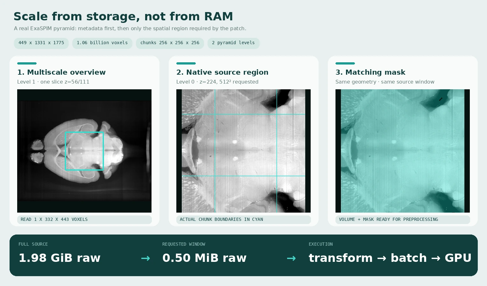

# Processing large images

Use this guide when a case is too large to materialise comfortably in RAM, or
when you want OME-Zarr, HDF5, DICOM, or ITK storage to participate directly in
patch loading. KonfAI can request regional windows from these backends, but
whether a workflow actually streams is determined by both the dataset settings
and the transform chain.

<figure class="kf-visual kf-visual--wide">
  <a class="kf-visual-frame" href="../_static/gallery/scale-omezarr.webp" aria-label="Open the OME-Zarr regional-read figure at full resolution">
    <picture>
      <source media="(max-width: 640px)" srcset="../_static/gallery/scale-omezarr-mobile.webp" width="500" height="2147">
      
    </picture>
  </a>
  <figcaption>
    <span class="kf-visual-copy">
      <strong>One bounded request through KonfAI's OME-Zarr backend.</strong>
      <span class="kf-visual-meta">1.98 GiB source volume · 0.50 MiB native image window · matching mask region</span>
    </span>
    <a class="kf-visual-inspect" href="../_static/gallery/scale-omezarr.webp">Inspect 1530 × 900 <span aria-hidden="true">↗</span></a>
  </figcaption>
</figure>

This is a real regional read from AIND ExaSPIM specimen `822175` (CC BY 4.0),
not a synthetic volume. The public source and derivative hashes are recorded in
the <a href="../_static/apps/ASSET_PROVENANCE.md">visual asset provenance manifest</a>.
Level 0 contains `449 × 1331 × 1775` uint16
voxels (1.98 GiB uncompressed) in `256³` chunks. The figure reads one coarse
level-1 plane to locate the field of view, then asks KonfAI for one 512² region
at native resolution and the identical region from the mask. Only 0.50 MiB of
image pixels is materialised for that native plane window.

## Choose the memory regime

Streaming is derived from the pipeline; there is no `streaming: true` switch.
`Dataset.use_cache`, the optional `memory_budget`, and the transform chain lead
each case and augmentation draw to one of three regimes:

| Regime | When | Memory held |
| --- | --- | --- |
| **Cache** | `use_cache: true` | Every case, resident across epochs. |
| **Stream** | `use_cache: false` and the chain is streamable | The source region for one patch. |
| **Buffer** | `use_cache: false` and the chain needs a whole volume | A FIFO of `max(batch_size + 1, shuffle_window)` cases. |

`memory_budget` may replace the declared `use_cache` decision in any workflow.
A number is interpreted as GiB, strings may include units, and `auto` offers
80% of the detected per-rank memory limit. It is a size estimate—not a hard
allocator limit—because transformed shapes, augmented copies, and transient
construction peaks are not included. See {doc}`../concepts/streaming` for the
exact precedence and {doc}`../config_guide/training` for `shuffle_window`.

```yaml
Dataset:
  dataset_filenames:
    - ./Dataset:omezarr
  use_cache: false
  batch_size: 2
  num_workers: 4
  Patch:
    patch_size: [64, 128, 128]
    overlap: 16
```

The equivalent source selector for a DICOM-series dataset is
`./Dataset:dicom`; `dcm` means a single file handled by SimpleITK, not the
DICOM-series backend. See {doc}`../reference/components/storage-backends` for
the exact layouts and format tokens.

## How the spatial planner derives a source read

Every transform declares its **patch locality**: exact voxel, bounded halo,
orientation remap, crop translation, global statistic, rescale, or whole
volume. KonfAI walks the transform and sampled-augmentation chain and maps the
requested output patch back to the source region on disk.

| Locality | Representative built-ins | Regional work |
| --- | --- | --- |
| Pointwise | fixed-bound `Clip`, `OneHot`, `TensorCast` | Read the exact patch. |
| Global statistic | `Normalize`, automatic `Standardize` | Stream the statistic once, then read the patch. |
| Halo | `Gradient`, `Dilate`, `Translate` | Enlarge the read and crop the result. |
| Orientation | `Flip`, `Permute`, axis-aligned `Canonical` | Remap indices to the source. |
| Crop | `Crop` once its box is known | Translate the target region. |
| Rescale | `ResampleToShape`, `ResampleToResolution` | Map through scale and add interpolation context. |
| Whole volume | masked transforms, histogram matching, arbitrary displacement | Use the bounded buffer. |

One region stage may appear in a streamable chain. Two remaps/halos/rescales,
an undeclared custom transform, an excessively large halo, or a global
statistic after a value-changing stage selects the safe whole-volume path.
`WHOLE_VOLUME` is the default for custom transforms, so missing locality
metadata reduces performance rather than silently changing results.

The backend must also serve a disk region efficiently. HDF5 and OME-Zarr do so
natively, DICOM reads selected slices, and SimpleITK supports regional reads for
uncompressed MetaImage and non-gzipped NIfTI. Compressed/unsupported formats
still return correct patches but may decode the volume for every request, with
a warning. The complete planner rules, built-in declarations, equivalence
tolerances, and custom-transform contract live in {doc}`../concepts/streaming`.

## OME-Zarr layout and levels

Use one store per case and group:

```text
Dataset/
├── CASE_001/
│   └── CT.ome.zarr/
└── CASE_002/
    └── CT.ome.zarr/
```

The selector may include a pyramid level, for example `omezarr@1`. KonfAI reads
metadata through `get_infos()` and touches only chunks intersecting the selected
window during a regional read. Chunk shape still matters: chunks much larger
than patches increase unnecessary I/O; very small chunks increase metadata and
decompression overhead.

The figure above is reproducible when the local ExaSPIM store is available:

```bash
pixi run --environment dev python docs/scripts/generate_scale_gallery.py \
  --root /path/to/ExaSPIM_Template/Data/Dataset_prepared \
  --case 822175
```

The generator calls `Dataset.get_infos()` for metadata and
`Dataset.read_data_slice()` for every displayed region. It never calls
`read_data()` or converts the full store to an in-memory array.

## Dataset patching versus model patching

These solve different problems:

- `Dataset.Patch` controls what the dataloader sends to the model. Use it to
  bound source, preprocessing, batch, and forward memory.
- `Model.ModelPatch` splits data again inside a KonfAI network. Use it for a
  heavy subgraph, a 2D/2.5D model inside a 3D workflow, or intermediate
  patch-level supervision.

Do not add model patching merely because dataset patches overlap. Start with
dataset patching, then add `ModelPatch` only if a network stage has a separate
memory or dimensionality requirement. See {doc}`../concepts/model-graph`.

## Tune in this order

1. Set `use_cache: false` to force the stream/buffer path, or set a
   `memory_budget` when dataset size should decide.
2. Choose the largest `patch_size` that fits the model and required context.
3. Start with `batch_size: 1`; increase it while measuring throughput and VRAM.
4. Add overlap only when border quality requires it. More overlap means more
   reads and forward passes.
5. Increase `num_workers` until storage or CPU preprocessing is saturated.
6. Try `pin_memory: true` for CUDA transfer, then measure; it consumes locked
   host memory and is not universally faster.
7. Use `prefetch_factor` only with worker processes and account for the extra
   prefetched batches in RAM.

Prediction may keep a reassembly accumulator on the GPU when it fits and fall
back to CPU accumulation when it does not. Mean/Cosinus overlap blending and
Mean/Median/Concat model or TTA reductions have different memory costs. The
canonical prediction fields are in {doc}`../config_guide/prediction`.

When the reassembled output itself is the memory peak, streaming handles it
automatically — there is no flag to set. Each output slab is finalized and
written to disk as soon as its patches complete, so peak RAM is one patch window
instead of the whole volume. It applies per case only when it is byte-identical
to the assembled path (a voxel-local finalize chain, a single augmentation, an
`mha`/`h5`/`omezarr` destination) and uses the whole-volume write transparently
otherwise. `KONFAI_STREAMED_WRITES=0` forces the whole-volume path globally.

## Verify the behaviour you care about

Do not infer streaming from a successful run alone—the fallback is designed to
remain correct. Measure peak RSS and storage reads on a representative case,
and compare the same model, patch size, overlap, TTA, batch size, workers, and
hardware when evaluating performance.

KonfAI currently has no committed framework-wide benchmark against MONAI or
nnU-Net under those controlled conditions. The regional-read mechanism is
implemented and tested; general speedup claims require separate evidence.

## Common failures

- **RSS still scales with case size:** the planner selected the bounded
  whole-volume path for that case or augmentation draw. Inspect the locality
  rules, or preprocess the unsupported operation once with `Save` and stream
  from that materialised dataset.
- **OME-Zarr is slow:** inspect chunk shape, compression, pyramid level, worker
  count, and overlap. Avoid assuming more workers always improve remote storage.
- **Output seams are visible:** add overlap and select a compatible
  `patch_combine`; confirm patch read and reassembly ordering has not been
  changed by custom code.
- **CUDA OOM occurs after forwards complete:** the volume-sized output or
  reduction may be the peak. Reduce output channels/TTA/ensemble size or let the
  predictor use CPU accumulation.

## Next steps

- {doc}`../reference/components/storage-backends` — backend capabilities and exact layouts
- {doc}`../concepts/streaming` — planner rules, locality table, and fallbacks
- {doc}`../config_guide/training` — loader, cache, patch, and worker fields
- {doc}`../config_guide/prediction` — batching, TTA, ensembles, reduction, and output writing
