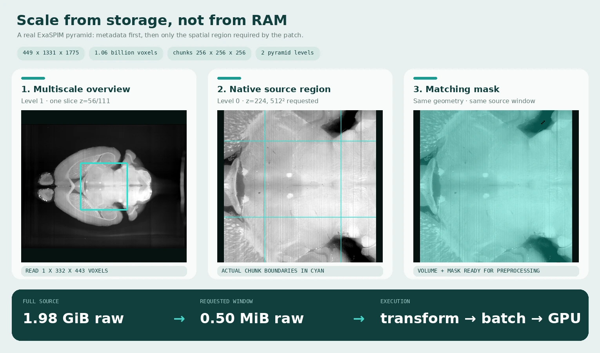

# Working out of core

A case larger than your RAM is a normal case. This page is how you set one up and
tune it; {doc}`../concepts/streaming` is what the engine does with it.

<figure class="kf-visual kf-visual--wide">
  <a class="kf-visual-frame" href="../_static/gallery/scale-omezarr.webp" aria-label="Open the OME-Zarr regional-read figure at full resolution">
    <picture>
      <source media="(max-width: 640px)" srcset="../_static/gallery/scale-omezarr-mobile.webp" width="500" height="2147">
      
    </picture>
  </a>
  <figcaption>
    <span class="kf-visual-copy">
      <strong>One bounded request through KonfAI's OME-Zarr backend.</strong>
      <span class="kf-visual-meta">1.98 GiB source volume · 0.50 MiB native image window · matching mask region</span>
    </span>
    <a class="kf-visual-inspect" href="../_static/gallery/scale-omezarr.webp">Inspect 1530 × 900 <span aria-hidden="true">↗</span></a>
  </figcaption>
</figure>

A real read from AIND ExaSPIM specimen `822175` (CC BY 4.0), not a synthetic
volume. Level 0 holds `449 × 1331 × 1775` uint16 voxels, 1.98 GiB uncompressed,
in `256³` chunks. The figure reads one coarse level-1 plane to locate the field
of view, then asks for one 512² region at native resolution and the identical
region of the mask: **0.50 MiB materialised** out of 1.98 GiB.

## A dataset that streams

```yaml
Dataset:
  dataset_filenames:
    - ./Dataset:omezarr
  memory_budget: auto
  batch_size: 2
  num_workers: 4
  Patch:
    patch_size: [64, 128, 128]
    overlap: 16
```

Prediction, evaluation and transform stream by default. Training caches unless
the dataset exceeds `memory_budget`, so setting a budget below your dataset's
size is how you force the streaming path there.

The format decides how cheap it is. HDF5 and OME-Zarr serve regions natively,
DICOM reads per slice, and SimpleITK serves them for uncompressed MetaImage and
non-gzipped NIfTI. Anything compressed still returns correct patches, but decodes
the whole volume for each one. The token for a DICOM series is `./Dataset:dicom`;
`dcm` means a single file through SimpleITK, which is a different backend.

## OME-Zarr layout

One store per case and group:

```text
Dataset/
├── CASE_001/
│   └── CT.ome.zarr/
└── CASE_002/
    └── CT.ome.zarr/
```

The selector can name a pyramid level, `omezarr@1`. KonfAI reads metadata through
`get_infos()` and touches only the chunks that intersect the window. Chunk shape
matters: chunks much larger than your patches cost I/O you throw away, very small
ones cost metadata and decompression overhead.

Reproduce the figure above with a local ExaSPIM store:

```bash
pixi run --environment dev python docs/scripts/generate_scale_gallery.py \
  --root /path/to/ExaSPIM_Template/Data/Dataset_prepared \
  --case 822175
```

The generator only calls `get_infos()` and `read_data_slice()`, never
`read_data()`.

## Tune in this order

1. `memory_budget` first: `auto` decides from the dataset's size, an explicit
   value below it forces streaming.
2. `patch_size`: leave an axis at `0` and KonfAI sizes it, taking the whole
   volume when it fits and shrinking on OOM. Otherwise pin the largest size your
   model and context need.
3. `batch_size: 1` to start, raise it while watching throughput and VRAM.
4. Overlap only when the borders need it: more overlap is more reads and more
   forward passes.
5. `num_workers` up until storage or CPU preprocessing saturates.
6. `pin_memory: true` then measure; it locks host memory and is not always
   faster.
7. `prefetch_factor` only with worker processes, and count the extra batches in
   RAM.

## Two kinds of patching

They solve different problems and stack:

- `Dataset.Patch` decides what the dataloader hands the model. It bounds source,
  preprocessing, batch and forward memory.
- `Model.ModelPatch` splits again inside the network, for a heavy subgraph, a
  2D or 2.5D model inside a 3D workflow, or patch-level supervision.

Start with dataset patching. Add `ModelPatch` only when a stage of the network
has its own memory or dimensionality requirement. See
{doc}`../concepts/model-graph`.

## When the output is the peak

Prediction keeps its reassembly accumulator on the GPU when it fits and falls
back to host memory when it does not. Streaming handles the rest on its own:
slabs are written as they complete, and geometry inverses stream with them, so a
full-resolution multi-class output never exists whole. That is the case where
streaming pays most, and {doc}`../concepts/streaming` covers what it can and
cannot honour.

## When it does not do what you expected

- **RSS still grows with the case**: the planner took the whole-volume path for
  that case or that augmentation draw. Check the locality rules, or run the
  unsupported stage once through `Save` and stream from the materialised
  dataset. The `Save` itself streams: its cache is written slab by slab on first
  access.
- **OME-Zarr is slow**: look at chunk shape, compression, pyramid level, worker
  count and overlap. More workers do not always help on remote storage.
- **Seams in the output**: add overlap and pick a compatible `patch_combine`. If
  you have custom code in the loop, check it has not changed patch ordering.
- **CUDA OOM after the forwards finish**: the volume-sized output or the
  reduction is the peak. Cut output channels, TTA or ensemble size, or let the
  predictor accumulate on the host.

A successful run does not prove streaming happened, since the fallback is
designed to stay correct. Measure peak RSS on a representative case, and hold the
model, patch size, overlap, TTA, batch size, workers and hardware fixed when you
compare.

## Next steps

- {doc}`../concepts/streaming`: what decides the path, and how close streamed is
  to whole.
- {doc}`../reference/components/storage-backends`: backend capabilities and
  layouts.
- {doc}`../config_guide/prediction`: batching, TTA, ensembles, reductions, output
  writing.
