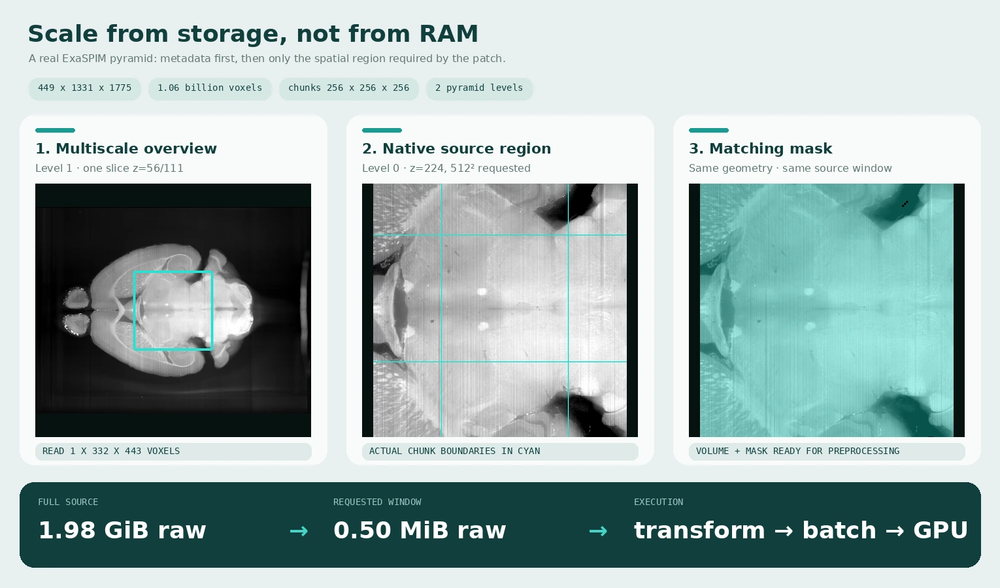

# Working out of core

A case larger than your RAM is an ordinary case in KonfAI. This page shows how to set up a dataset that
streams, what to tune, and what KonfAI does when a chain cannot stream.

<figure class="kf-visual kf-visual--wide">
  <a class="kf-visual-frame" href="../_static/gallery/scale-omezarr.webp" aria-label="Open the OME-Zarr regional-read figure at full resolution">
    <picture>
      <source media="(max-width: 640px)" srcset="../_static/gallery/scale-omezarr-mobile.webp" width="500" height="2147">
      
    </picture>
  </a>
  <figcaption>
    <span class="kf-visual-copy">
      <strong>One bounded request through KonfAI's OME-Zarr backend.</strong>
      <span class="kf-visual-meta">1.98 GiB source volume · 0.50 MiB native image window · matching mask region</span>
    </span>
    <a class="kf-visual-inspect" href="../_static/gallery/scale-omezarr.webp">Inspect 1530 × 900 <span aria-hidden="true">↗</span></a>
  </figcaption>
</figure>

A real read from AIND ExaSPIM specimen `822175` (CC BY 4.0): one coarse plane to find the field of view,
then one 512² region at full resolution and the same region of the mask. 0.50 MiB is read out of 1.98 GiB.

## A dataset that streams

```yaml
Dataset:
  dataset_filenames:
    - ./Dataset:omezarr
  memory_budget: auto
  batch_size: 2
  num_workers: 4
  Patch:
    patch_size: [64, 128, 128]
    overlap: 16
```

Prediction, evaluation and transform stream by default. With test-time augmentation, prediction reads a case
whole when that fits `memory_budget`, so its chain runs once for all the copies. Training keeps the dataset in
memory unless it is larger than `memory_budget`: set a budget below the dataset's size to make training stream too.

The format decides how cheap a region read is:

| Format | Region reads |
| --- | --- |
| OME-Zarr, HDF5 | yes, natively (`omezarr@1` reads pyramid level 1) |
| DICOM series (`:dicom`) | yes, slice by slice |
| MetaImage, NIfTI | yes; a compressed file (`.nii.gz`, compressed `.mha`) is first decompressed once per run into `~/.cache/konfai/decompressed` |
| NRRD | correct but slow: the whole volume is decoded for every region |

Set `KONFAI_DECOMPRESSED_DIRECTORY` to put the decompressed copies on another disk (see
[compressed files](../reference/components/storage-backends.md#compressed-files)). An OME-Zarr dataset holds
one store per case and group (`Dataset/CASE_001/CT.ome.zarr/`); chunks much larger than your patches waste
reads, very small ones waste decompression time.

A public example needs no download: with `pip install konfai[s3]` and `FSSPEC_S3_ANON=true`, the entry
`s3://aind-open-data/exaSPIM_822174_2026-04-28_12-29-55_processed_2026-07-09_03-49-09:omezarr` streams
ExaSPIM specimen `822174` (513 × 1331 × 1775, CC BY 4.0) region by region. The large-images notebook on
{doc}`../examples/index` reads it.

## What to tune, in order

1. **`memory_budget`.** Give it what the machine can spare. A larger budget means larger regions and fewer
   repeated reads: on one 513 × 1331 × 1776 OME-Zarr volume, the same resampling takes 5 s at 4 GiB and 49 s
   at 256 MiB. `auto` takes 80% of the memory (or of the container's limit), split between processes. A bare
   number is GiB; `"24GB"` and `"512mb"` also work.
2. **`patch_size`.** A `0` on an axis lets KonfAI choose it: the whole axis when it fits, otherwise equal
   parts. Otherwise use the size your model needs.
3. **`batch_size`.** Start at 1 and raise it while watching speed and GPU memory.
4. **`overlap`.** Only as much as the borders need: more overlap is more reads and more forward passes.
5. **`num_workers`.** Raise it until the disk or the CPU is saturated.
6. **`pin_memory`.** Measure before keeping it: the copy to the GPU gets faster, but the step rarely does.

`memory_budget` limits the buffers KonfAI holds for your data, including the OME-Zarr chunk cache (a third of
it). Python, torch, the model and the workers come on top, so the peak memory of a run is the budget plus a
fixed floor.

## Two levels of patching

- **`Dataset.Patch`** cuts what the loader hands the model. Keys: `patch_size` (default `[128, 128, 128]`),
  `overlap` (voxels, a fraction or a per-axis list; `null` means 20%), `pad_value` (`null` pads with the
  minimum) and `extend_slice` (2.5-D context when `patch_size[0] == 1`).
- **`Model.ModelPatch`** cuts again inside the network: for a heavy part of the network, or a 2-D model
  inside a 3-D workflow. `patch_combine` blends the overlaps: `Mean`, `Cosinus`, `Trim` or `Gaussian`.

Start with `Dataset.Patch`. Add `ModelPatch` only when part of the network has its own memory or dimension
needs, as in the `examples/Synthesis` GAN (3-D blocks for the GAN, 2-D slices in the generator).

## Patch streaming

When every stage of a chain can work on a region, each patch reads only the part of the file it needs, and
the output is written slab by slab as it completes. Neither the input nor the output is ever whole in
memory. Nothing in the YAML asks for it: KonfAI reads the chain and streams when it can. When it cannot, it
loads the volume, and the result is the same; only memory and speed change.

```{mermaid}
flowchart TB
    F[(the file on disk)]:::disk
    subgraph one[" per patch "]
        direction TB
        RR[read one source region]:::step
        CH[run the chain on it]:::step
        M[[model]]:::model
        RR --> CH --> M
    end
    F -- "only the region<br/>the patch needs" --> RR
    M --> AC[accumulate,<br/>overlap blended]:::step
    AC --> WS[write slab by slab]:::step
    WS --> OUT[(the result on disk)]:::disk

```

Under `TRANSFORM`, peak memory follows `memory_budget`, not the volume:
`python benchmarks/bench_streaming.py --gib 16 --budget 1` reports the peak of a 16 GiB volume under a 1 GiB
budget ([Reproducing the numbers](#reproducing-the-numbers)).

It also makes published models faster and lighter. Same weights, same GPU, against the original tools
(`benchmarks/perf/bench_apps.py`, 2026-09-09):

| Model, large case (512 × 512 × 531) | Time | Peak host RAM | Peak VRAM |
| --- | --- | --- | --- |
| MRSegmentator, KonfAI | **86 s** | **6.9 GB** | 20.6 GB |
| MRSegmentator, original | 143 s | 37.4 GB | 14.9 GB |
| TotalSegmentator, KonfAI | **212 s** | **17.6 GB** | **10.6 GB** |
| TotalSegmentator, original | 377 s | 47.9 GB | 23.1 GB |

Across case sizes: 1.1 to 3.9 times faster, with 1.4 to 5.4 times less host RAM. The full tables are on the
[MRSegmentator](https://github.com/fideus-labs/KonfAI/tree/main/apps/mrsegmentator) and
[TotalSegmentator](https://github.com/fideus-labs/KonfAI/tree/main/apps/totalsegmentator) app pages.

### Which chains stream

Each stage declares what it reads for one output voxel. A chain streams when every stage reads a bounded
region:

| Kind | Stages |
| --- | --- |
| the same voxel | `Argmax`, `Softmax`, `Sum` (over channels), `OneHot`, `MergeLabels`, `UnNormalize`, `Mask`, `Clip` with fixed bounds, `TensorCast` to `float32`/`float64` |
| a whole-volume statistic, read once | `Normalize`, `Standardize`, `Clip` with `'min'`/`'max'` bounds |
| a neighbourhood | `Dilate`, `Gradient` |
| a flip or permutation | `Flip`, `Permute`, `Canonical` (axis-aligned) |
| a sub-box | `Crop` |
| another grid | `Resample`, `Padding` |

Augmentations declare it per copy: flips, permutations, quarter turns, intensity changes, `Noise`, `CutOUT`,
`Translate`, free rotations and `Scale` stream; `Elastix` and `PlacedMask` load the volume.

A chain loads the whole volume when:

- a stage needs it (percentile `Clip`, `HistogramMatching`, `Canonical` on an oblique volume, a reduction
  over a spatial axis);
- a statistic comes after a stage that changes values, as in `[Clip, Standardize]`: the statistic stored with
  the volume is not the one of `Standardize`'s input. Put a `Save` in between: the saved copy is written
  slab by slab once, and the rest of the chain streams from it;
- a neighbourhood is wider than half the region.

In training, prediction and evaluation, a statistic after a value-changing stage costs one whole read per
case (the loader says how many), then the case streams.

`transforms` runs once per case, `patch_transforms` once per patch. `patch_transforms` accepts only
same-voxel and statistic stages, and a statistic there is the patch's own.

### The output

The output streams too: each slab is written when its patches are done, and inverse transforms
(`Canonical`, `Flip`, `Permute`, `Padding`, `Resample`) are applied slab by slab on the way out. This is
where streaming pays most: a multi-class probability map resampled back to the native grid can be tens of GB
whole.

A case that cannot stream its output says why, once:

```text
[KonfAI] streaming: case 'CASE_000' takes the whole-volume path: <reason>.
```

The reasons: a test-time augmentation that flips the slab axis, a case too small to be worth it, a
reduction that is not voxel-by-voxel, or a destination format without region writes.
`KONFAI_STREAMED_WRITES=0` turns streamed writes off, to compare against.

### Is the result the same?

A streamed patch is identical to the same patch cut from the loaded volume for same-voxel, neighbourhood,
flip and crop stages. Two cases differ by a tiny, bounded amount:

- a statistic (`Mean`, `Std`) summed in another order, a few float32 units in the last place;
- a linear `Resample` through a rotation or a displacement field, on the GPU or on an oblique volume: about
  1e-5 of the data's range (within 1 on integer volumes).

Nearest, cubic and axis-aligned resampling are identical. The slab height depends on the machine's budget,
and changes nothing else.

## When it does not do what you expected

- **Memory still grows with the case.** A stage loads the whole volume. Check the tables above, or run that
  stage once through `Save` and stream from the saved copy.
- **OME-Zarr is slow.** Look at the chunk shape, the compression, the pyramid level, the workers and the
  overlap.
- **Seams in the output.** Add overlap and choose a `patch_combine`.
- **CUDA out of memory after the forward passes.** The output or the ensemble is the peak: reduce the output
  channels, the TTA or the ensemble size.

A successful run does not prove that it streamed. Measure the peak memory on a representative case.

## Reproducing the numbers

Every performance number in this documentation can be re-run with the scripts in
[`benchmarks/`](https://github.com/fideus-labs/KonfAI/tree/main/benchmarks).

- **Protocol** (`benchmarks/perf/`): a benchmark refuses to run on a busy machine (`--force` records anyway,
  with warnings). Each result records the commit, versions, CPU, GPU, driver and power profile. Time is the
  median of three runs after a warm-up. Host memory is the peak of the whole process tree, workers included.
- **Streaming**: `python benchmarks/bench_streaming.py --gib 16 --budget 1` builds a 16 GiB volume, runs a
  TRANSFORM chain on it under a 1 GiB budget, and prints the peak memory and the time. `--gib 4` (the
  default) is faster.
- **App tables**: `benchmarks/perf/bench_apps.py` produces them from a manifest naming each app, the original
  tool and the cases (`apps_manifest.example.json`). It needs the weights, the original tools and the cases,
  which are not in the repository. These are measurements on given cases, not a general promise: measure on
  yours.

## Next steps

- {doc}`../reference/components/storage-backends`: formats, layouts, and reading from object storage.
- {doc}`../config_guide/prediction`: batching, TTA, ensembles and output writing.
- {doc}`../config_guide/transform`: the plan a TRANSFORM run prints.
- {doc}`custom-models`: making a transform of your own stream.
