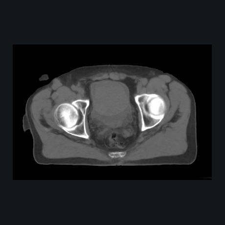
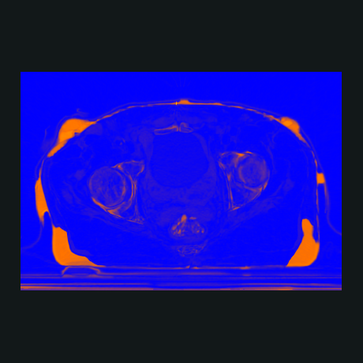
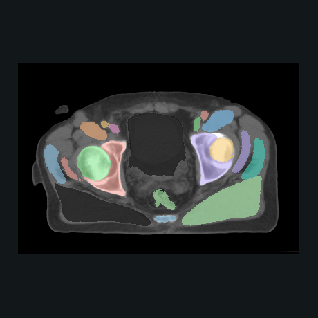
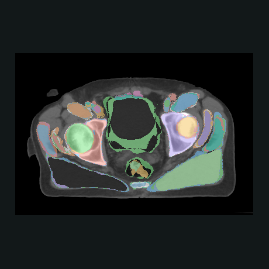

# Making datasets, without a model

The fourth workflow has no network, no checkpoint and no training loop. It reads
a dataset, runs a chain of transforms over it, and writes a dataset:

```bash
konfai TRANSFORM --config Transform.yml --plan   # what it would do
konfai TRANSFORM --config Transform.yml          # do it
```

Same engine as the rest: the chain streams when it can, so a cohort larger than
your RAM is a normal cohort. Same reflex too, plan before you run. A case whose
output already exists is skipped, so an interrupted run resumes.

## Preprocess a cohort once

The everyday use: bring a whole dataset onto one grid, in one pass, in a format
that streams later.

```yaml
Transformer:
  name: RESAMPLE_TO_ISO
  Dataset:
    dataset_filenames: [./Raw:mha]
    groups_src:
      CT:
        groups_dest:
          CT_iso:
            transforms:
              Resample: {spacing: [1.0, 1.0, 1.0]}
              Write:    {dataset: ./Out:omezarr}
```

That writes `./Out/<case>/CT_iso.ome.zarr/` per case, one slab at a time.

## Fold a cohort into one volume

A chain becomes N-to-1 the moment it carries a `Reduce`. Everything before it
runs per case, the fold happens at fixed voxel, everything after runs once on the
result. The engine walks the output's regions and, within a region, the cases, so
the peak is a few regions rather than N volumes.

```yaml
transforms:
  Resample: {reference: atlas_000, reference_group: CT, transforms: {reg: false}}
  Reduce:   {operator: Median, output: template, grid: strict}
  Write:    {dataset: ./Template:mha}
```

`Resample` puts the members on one grid, and `transforms:` carries each one
through the registration already solved for it, so the fold averages anatomy that
corresponds rather than anatomy that merely overlaps. `grid: strict` checks the
geometry; nothing can check the anatomy, which is why the registration belongs in
the chain.

<ul class="kf-example-grid kf-example-grid--compact" aria-label="Four registered pelvis CT cases folded into one volume">
  <li><figure class="kf-example-card"><a class="kf-example-media" href="../_static/gallery/capabilities/fold-source.png"></a><figcaption><span class="kf-example-step">IN</span><strong>One of four cases</strong><span>Each carried onto the reference by its own registration.</span></figcaption></figure></li>
  <li><figure class="kf-example-card"><a class="kf-example-media" href="../_static/gallery/capabilities/fold-median.png"></a><figcaption><span class="kf-example-step">OUT</span><strong>Median template</strong><span>One volume, whatever the cohort's size.</span><span class="kf-example-stats">operator: Median</span></figcaption></figure></li>
  <li><figure class="kf-example-card"><a class="kf-example-media" href="../_static/gallery/capabilities/fold-std.png"></a><figcaption><span class="kf-example-step">OUT</span><strong>Where the cohort varies</strong><span>Same chain, one word changed.</span><span class="kf-example-stats">operator: Std</span></figcaption></figure></li>
</ul>

`operator` picks how the cases combine: `Mean`, `Median` and `Std` over
intensities, `Concat` to stack them side by side, and `Vote` for label maps.

<ul class="kf-example-grid kf-example-grid--compact" aria-label="The same label maps folded with Vote and with Mean">
  <li><figure class="kf-example-card"><a class="kf-example-media" href="../_static/gallery/capabilities/fold-vote.png"></a><figcaption><span class="kf-example-step">Vote</span><strong>Labels that exist</strong><span>The label the most cases agree on, per voxel.</span><span class="kf-example-stats">KEEPS uint8</span></figcaption></figure></li>
  <li><figure class="kf-example-card"><a class="kf-example-media" href="../_static/gallery/capabilities/fold-labelmean.png"></a><figcaption><span class="kf-example-step">Mean</span><strong>Labels that do not</strong><span>The average of labels 16 and 17 is 16.5, a structure nobody has.</span><span class="kf-example-stats">float32 · 82 DISTINCT VALUES</span></figcaption></figure></li>
  </ul>

Both are real folds of the same four label maps: `Vote` keeps the dtype and picks
a label from the input, `Mean` widens to float32 and invents the rest.

## Turn one case into many

`Expand` is the mirror, 1-to-N. Stages before it run once per case, stages after
it run once per copy, and draws interleave with transforms freely:

```{mermaid}
flowchart LR
    subgraph fold["Reduce: N to 1"]
        direction LR
        c1[case 1]:::case --> R{{Reduce}}:::marker-node
        c2[case 2]:::case --> R
        c3[case N]:::case --> R
        R --> t[one volume<br/>named by output]:::out
    end
    subgraph draw["Expand: 1 to N"]
        direction LR
        c[one case]:::case --> X{{Expand}}:::marker-node
        X --> k1[copy 01]:::out
        X --> k2[copy 02]:::out
        X --> k3[copy N]:::out
    end
    fold ~~~ draw

```

A chain changes its cardinality at most once. Doing both, augmenting a cohort
then folding it, is two runs, the second reading the first one's output.

```yaml
transforms:
  Clip:   {min_value: 0.0, max_value: 400.0}   # once per case
  Expand: {nb: 8, pattern: "{name}_r{a:02d}"}
  Rotate: {a_min: -15, a_max: 15}              # per copy
  Write:  {dataset: ./Augmented:omezarr}
```

Each draw is derived from the seed, the case and its position in the chain, so an
image chain and its mask chain produce matching copies: copy `k` of the mask
carries copy `k` of the image's rotation.

## Write for another tool

A `Write` names a format, and one of them is not an image. `:itktransform`
stores a displacement field as an ITK transform file, which 3D Slicer and any
ITK consumer open directly, written region by region so the field never has to
fit in memory:

```yaml
transforms:
  Write: {dataset: ./Fields:itktransform}   # -> ./Fields/<case>/DVF.h5
```

`Save` and `Write` also build OME-NGFF pyramids on the way out with
`scale_factors: [4]`, so a viewer gets its coarse levels for free.

## Read the plan

Every run prints its plan before touching data, and `--plan` prints it and stops.
Each case gets a verdict:

```text
  CT -> CT_iso: 120 case(s) -- 118 STREAM, 2 WHOLE-VOLUME, 0 SKIP
```

```{mermaid}
flowchart TB
    A{already<br/>written?} -- yes --> SKIP([SKIP]):::skip
    A -- no --> B{a Reduce<br/>in the chain?}
    B -- yes --> RED([REDUCE]):::fold
    B -- no --> C{every stage<br/>streamable?}
    C -- no --> WV([WHOLE-VOLUME]):::load
    C -- yes --> D{re-reads the source<br/>more than 1.5x?}
    D -- yes --> LOAD([LOAD]):::load
    D -- no --> STR([STREAM]):::stream

```

`SKIP` means the run resumes, `REDUCE` folds the cohort, `WHOLE-VOLUME` names the
stage that refused to stream, `STREAM` reads region by region.
`LOAD` is a cost decision, not a failure: past a threshold, reading the case once
beats reading regions of it many times. A run writes its plan to
`Transforms/<name>/plan.txt` next to an `outputs.json` saying where each
deliverable landed.

## In Python

The same workflow is a function, and a chain is a list of stage objects:

```python
import konfai
from konfai.data.transform import Reduce, Resample, Write

konfai.transform("template", "./Cohorte:mha",
    {"CT": {"CT": [Resample(reference="atlas_000", reference_group="CT"),
                   Reduce(operator="Median", output="template", grid="strict"),
                   Write(dataset="./Template:mha")]}})
```

`konfai.plan_transform(...)` takes the same arguments and returns the plan
without running anything. See {doc}`python-workflows`.

## Next steps

- {doc}`../examples/transform`: both configs above, runnable, on data it
  generates itself in about a minute.
- {doc}`../config_guide/transform`: every key, every refusal, and the
  cardinality rules in full.
- {doc}`../reference/components/transforms`: the catalogue of stages.
- {doc}`../concepts/streaming`: what decides whether a chain streams.
