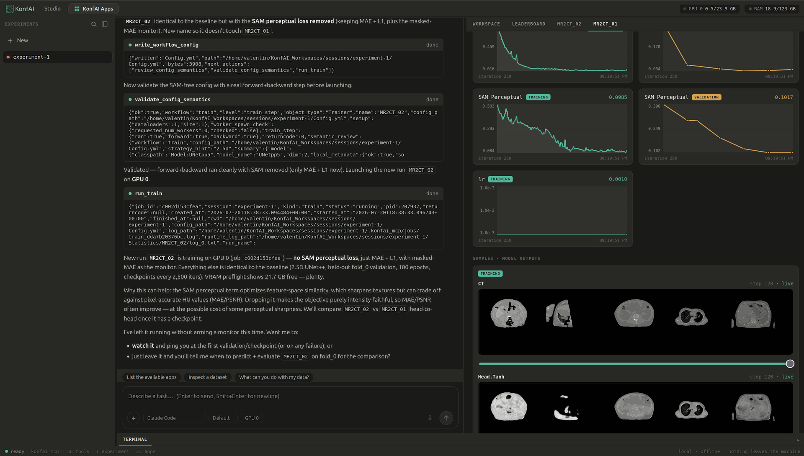

# KonfAI Studio



A single **chatbot** (à la ChatGPT / Claude, specialized for medical imaging) that drives
`konfai-mcp` end to end. A clinician-researcher points it at their own dataset and, from the
conversation alone, onboards data, authors/reuses a model, trains, infers, visualizes results,
compares, keeps & reproduces experiments, then deploys the frozen model privately (on-prem or
100% in the browser). The compute stays on the user's site; nothing is uploaded to a third party.

**This is a product surface, not a new engine.** Every capability maps 1:1 onto an existing
`konfai-mcp` tool (56 today). The build is the web UI + a thin bridge (BFF), plus the ONNX export.

## Layout

- `konfai_studio/`: the Python package (the BFF)
  - `server.py`: FastAPI that streams the chat over SSE, serves the front, streams volumes to NiiVue
  - `agent.py`: the pluggable brain (`KONFAI_STUDIO_LLM`): `claude-code` (Claude Agent SDK, default),
    `openai` (local vLLM/Ollama or any OpenAI-compatible endpoint), `anthropic` (Claude API)
  - `web/`: the built front (`index.html` + `assets/`, git-ignored; logos are committed)
- `frontend/`: the React + Vite source (chat panel + NiiVue viewer; `npm run build` emits into `web/`)
- `docs/`: the spec and the remote-deployment guide

## Run

```bash
pip install konfai-studio
konfai-studio                           # -> http://127.0.0.1:8730
```

The published wheel already ships the built front. The default brain uses your
**Claude Code subscription** (no API key); `konfai-studio[openai]` and
`konfai-studio[anthropic]` add the alternatives. For a local model:
`KONFAI_STUDIO_LLM=openai KONFAI_STUDIO_LLM_BASE_URL=http://localhost:11434/v1 KONFAI_STUDIO_MODEL=qwen2.5:14b konfai-studio`.

## Develop from a checkout

The front is git-ignored, so a checkout has to build it. `konfai-mcp` comes first:
Studio pins it to its own setuptools_scm version, which only exists on PyPI at a
release tag.

```bash
pip install -e ./konfai-mcp             # must precede studio: the pin is version-exact
pip install -e ./studio                 # deps: fastapi, uvicorn, fastmcp, claude-agent-sdk
npm --prefix studio/frontend install    # once
npm --prefix studio/frontend run build  # builds the front into konfai_studio/web/
```

Front hot-reload during development: `npm --prefix studio/frontend run dev` (proxies to the BFF).

See [`docs/STUDIO_SPEC.md`](docs/STUDIO_SPEC.md) for the design, and
[`docs/REMOTE.md`](docs/REMOTE.md) to serve it beyond loopback.
