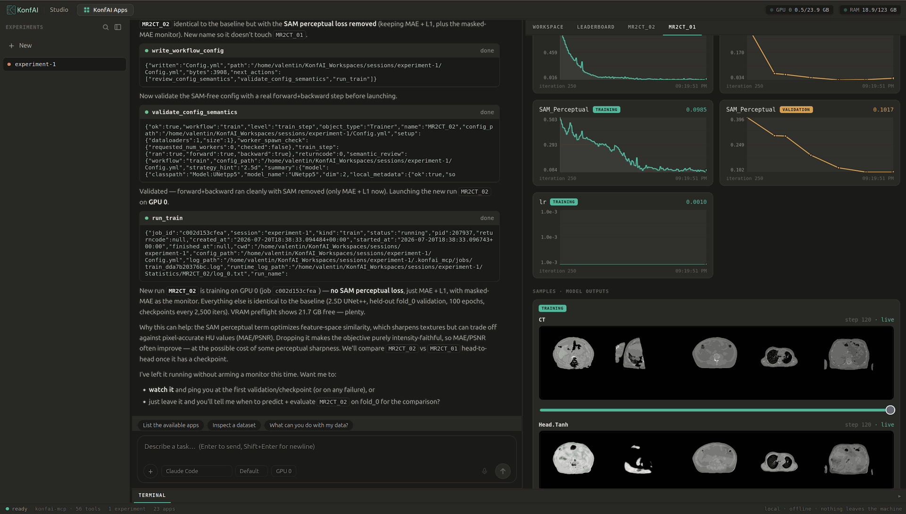

# KonfAI Studio — Spec of the final result

> What a user will be able to do. Grounded in the actual `konfai-mcp` surface (56 tools),
> the `konfai-apps` remote server, and the `konfai-rs`/`konfai-web` deploy work.
> Visual version with UI mockups: [`spec-visual.html`](spec-visual.html). Strategy brief: [`brief-for-matt.html`](brief-for-matt.html).

## 1. Vision

One **chatbot** drives the whole KonfAI engine. The clinician-researcher points at their **own
dataset** and, from the conversation, onboards → authors/reuses → trains → infers → visualizes →
compares → keeps & reproduces → deploys. The UI is a façade over `konfai-mcp`; every ability below
maps 1:1 onto a real MCP tool.

Two goal layers:
- **Mission** — collapse the distance between a clinical question and a deployed, private,
  reproducible model, from months of ML engineering to a conversation. The person who owns the
  problem owns the whole loop, on data that never leaves the institution.
- **Strategy (Fideus)** — the open-core product surface: the open engine drives adoption; the
  Studio layer + private-deployment story are what an institution pays for. It widens the audience
  from "engineers who write configs" to "anyone with a dataset and a question".

## 2. What the user will be able to do (functional spec)

Status legend: **[MCP]** already drivable on today's MCP API · **[build]** UI/export work · **[spike]** proven, to finish.

| # | Capability | What happens | Tools behind it | Status |
|---|---|---|---|---|
| 1 | **Bring a dataset** | Point at a folder; agent reads geometry, channels, classes, splits, ambiguities | `inspect_dataset`, `browse_dataset`, `read_dataset_file`, `preview_volume`, `prepare_dataset_aliases` | **[MCP]** |
| 2 | **Just describe the task** | The user picks a dataset and prompts — nothing else. The **agent** decides the route (reuse a published app · fine-tune it · train from scratch) and proposes it transparently ("a close liver app exists → I'll fine-tune it, ~15 min, instead of 6 h from scratch"); the user can override in conversation. Not a menu. | `solve_task` prompt routes → `import_app` → `run_prediction` / `run_resume(weights_only=True)` / (`design_config_strategy` → `write_workflow_config` → `run_train`) | **[MCP]** |
| 3 | **Author by conversation** | Agent writes the YAML, validates it, can run a real forward+backward before spending GPU hours | `write_workflow_config`, `review_config_semantics`, `validate_config_semantics(level='train_step')`, `describe_model_outputs` | **[MCP]** |
| 4 | **Train / predict / evaluate** | Launch jobs on the GPU (local or on-prem server), resume interrupted runs, sweep CV folds | `run_train`, `run_prediction`, `run_evaluation`, `run_resume`, `run_batch`, `generate_folds` | **[MCP]** |
| 5 | **Watch it live** | Live metrics + full TensorBoard curves in the tab; cancel anytime (whole process group reaped) | `read_live_metrics`, `read_training_curves`, `get_job_status`, `read_job_log`, `cancel_job` | **[MCP]** |
| 6 | **See the result** | CT/MR with the prediction overlaid on the scan, prediction-vs-GT | `preview_volume` (PNG today); **NiiVue** for interactive 3D overlays | **[build]** viewer |
| 7 | **Compare & rank** | Metric-by-metric comparison, config diff, leaderboard across runs and sessions | `get_run_metrics`, `compare_runs`, `diff_run_configs`, `leaderboard` | **[MCP]** |
| 8 | **Keep & reproduce** | Every run is frozen (exact command + environment + config); export a Methods-grade record; a colleague re-imports and re-runs it | `export_run_record`, `import_experiment` (+ auto config-snapshots & manifest) | **[MCP]** |
| 9 | **Package & deploy** | Turn a trained model into a shareable app; run it in Slicer, on an on-prem server, or export to ONNX to run 100% in a browser tab, offline | `package_app_from_session`, `export_app`; `konfai export` → `konfai-web`/`konfai-rs` | **[spike]** export = Phase 1 |

The MCP surface is **56 tools + 4 prompts + 23 read-only resources** (`konfai-mcp/konfai_mcp/server.py`;
generated reference `konfai-mcp/scripts/generate_tool_reference.py`). Three modeling entry points the
UI should expose as top-level choices: *use an app as-is*, *fine-tune an app*, *train from scratch*.

## 3. Session & reproducibility model (the UI must model this)

- A **session** = one isolated experiment workspace under `~/KonfAI_Workspaces/sessions/<name>/`
  (override with `$KONFAI_MCP_WORKSPACES_ROOT`). One "current session" at a time.
- A session holds many **runs**, each keyed by `train_name`: `Checkpoints/<name>`, `Statistics/<name>`
  (TensorBoard + resolved-config snapshot), `Predictions/<name>`, `Evaluations/<name>`.
- Lifecycle: `create_session` / `switch_session` / `initialize_session` (⚠ destructive with
  `overwrite=True`) / `summarize_session` / `delete_session`. Switching is **refused while a job is active**.
- **"Keep" is real** because on every launch, *before the process spawns*, the server freezes an
  immutable layer: `config_snapshots/` (the launch-time YAML, distinct from the live file that
  reflection keeps rewriting) + `manifest.json` (exact command, `created_at`, and an environment
  snapshot: Python/platform, KonfAI version, pinned `torch/numpy/SimpleITK/fastmcp/konfai-apps`
  versions, GPU names).
- **"Reproduce" is real** via `export_run_record` (Methods-grade receipt: manifest + frozen configs
  + resolved config + per-split metrics + log tail) → `import_experiment` (adopt an on-disk
  experiment: configs/code copied, artifacts symlink/copy/none) → validate → `run_resume`/`run_train`.
- **Caveat to surface in UI:** `export_run_record.resolved_config` reflects the *current* live YAML
  (reflection may have rewritten it); the authoritative launch-time truth is `config_snapshots` /
  `diff_run_configs`.

## 4. Where it runs — three topologies

The interface is always a browser; what sits behind it changes. Data leaves the site only where the
topology keeps compute on-prem or in the tab.

| Topology | User side | Data… | Status |
|---|---|---|---|
| **All-local** (Jupyter model) | browser + local GPU, install once | never leaves the machine | socle ready |
| **On-prem server** | browser / thin client, GPU on the lab server | stays in the institution's network | **already in production** (konfai-apps + SlicerKonfAI) |
| **In-browser** | browser only, WebGPU, no server | doesn't move at all | Phase 1 (ONNX export) |

**Remote already exists** (`konfai-apps` FastAPI server, `konfai-apps-server`): endpoints
`/apps/{app}/infer|evaluate|uncertainty|pipeline|fine_tune`, async jobs with `GET /jobs/{id}`,
`/jobs/{id}/logs` (SSE), `/result`, `/kill`; bearer-token auth; dataset upload (zip, zip-slip +
size guards); one job per GPU (semaphores). Client: `RemoteServer(host, port, token)`,
`AppRepositoryInfoFromRemoteServer` — the surface SlicerKonfAI already imports.
**Two caveats:** (a) it runs/fine-tunes **already-packaged apps only** — fresh agentic authoring
(inspect new dataset → author new config → train from scratch) is `konfai-mcp`'s job, not this
server; (b) remote = the data is **uploaded to the server**, so "nothing leaves the site" holds
only if that server is on-prem (default bind is loopback `127.0.0.1`; transport is plain HTTP +
bearer — a non-loopback deployment needs TLS).

## 5. Deploy pillar — scope and gate

- **Portable subset only:** frozen **feed-forward** models (segmentation / synthesis). **3D
  registration stays Python** — Burn's `grid_sample` is 2D-only, so VoxelMorph-style models can't run
  on Burn. TTA/ensemble/MC-dropout/diffusion also stay Python (MVP = single deterministic forward).
- **Spike GO** (`konfai-rs`, 2026-06-29): `KonfAI → ONNX(dynamo) → burn-onnx → Burn` runs with
  near bit-exact parity — MAE **6.3e-6** (CPU) / **5.5e-6** (WGPU) on `impact_synth` (UNet++ resnet34,
  2.5D, 26M params) vs ONNX Runtime. WGPU is the backend that compiles to WASM/WebGPU.
- **Two runtimes:** `konfai-web` (ONNX-Runtime-Web + WebGPU, generic — any bundle, no per-model
  build; JS runtime complete, testable via `onnxruntime-node`) and `konfai-rs` (native Burn, one
  artifact per architecture; CPU+WGPU proven natively).
- **Hard gate — Phase 1 `konfai export`:** both runtimes consume `model.onnx` + `manifest.json`;
  neither ships one (konfai-rs `build.rs` *panics* without it). Phase 1 = a pure-Python
  `konfai/export/onnx.py` + an `EXPORT` CLI state, folding pre/post into the graph, keeping the
  runtimes thin (file parse + geometry + tiling only). Manifest = input/output `{name,group,channels,
  dtype}`, `patch {size,overlap,dim}`, `preprocess/postprocess_in_graph`, `geometry: preserve_from_input`.
- **Still to prove/build:** real browser WebGPU run, volume tiling + overlap-blend + geometry-aware
  NIfTI/MHA I/O, full-volume parity vs the Python `Predictor`.
- **NiiVue** = the intended client-side WebGL2 viewer (native NIfTI + MHA, segmentation overlays,
  MIT). **Not yet integrated** — zero references in the codebase today.

## 6. Roadmap

| Milestone | Effort | Deliverable |
|---|---|---|
| Foundation | done | konfai-mcp (v1.6.0) + config-by-reflection + konfai-rs spike (GO) |
| **M0** | ~1–2 d | BFF FastAPI holding the MCP session + a static front on localhost |
| **M1** | ~1–2 w | Demo-able core: dataset (NiiVue) → chat/config → `run_train` → live curves → prediction-vs-GT overlay |
| **Phase 1** | ~3–5 d | `konfai export → model.onnx + manifest.json` (Python) — unlocks browser deploy |
| **M3** | ~2–3 w | In-tab deployment: konfai-rs/web infers client-side → NiiVue renders; volume tiling + geometry |

M0/M1 need **no new core code** — only today's MCP API.

## 7. Open decisions

1. **The chatbot's brain is a pluggable, user-chosen LLM** — the MCP is LLM-agnostic, so the BFF can
   connect any backend. Make it a setting, not a hardcoded choice: the Claude API (best tool-use /
   quality), a local model (100% on-prem, nothing leaves), or the institution's own LLM endpoint
   (Azure / on-prem). **Two privacy planes** — the *data plane* (volumes) is always local: MCP tools
   run on the GPU node and return only text (paths, stats, metrics, YAML), so **the imaging data never
   reaches the LLM**; only the *reasoning plane* (chat + tool-call args/results) goes to the chosen
   LLM. A cloud brain does not upload any voxel. Remaining decision = which backends to ship first and
   the default.
2. **Studio's status** — demonstrator first (optimize the M1 video) or Fideus product from day one
   (invest clinician UX / Slicer)? Same M0/M1, different priorities after.
3. **BFF packaging** — a separate `konfai-studio` package depending on `konfai-mcp` (consistent with
   the 3-package model), vs a submodule of `konfai-mcp`. Leaning separate package.

## 8. Live results — how the browser gets it in real time

The tension: `konfai-mcp` is request/response (poll); jobs run in spawn subprocesses that write to
disk (`Statistics/<name>/tb` tfevents, console log, `Checkpoints/`, `Predictions/`). The browser
needs push. The **BFF is co-located on the GPU node**, so it has filesystem access to the workspace
and bridges poll → push.

**Grounding (verified in code):** the trainer opens a TensorBoard `SummaryWriter` at
`Statistics/<train_name>/tb` (`konfai/trainer.py:224`) and writes scalars every train/val step
(`:540-580`); `konfai/utils/runtime.py:421-430` can additionally log **image summaries**
(`add_image`/`add_images`) for any output marked for it. So **live curves are free**, and **live
validation images** are emitted into the same tfevents stream when the config enables image logging
— no extra inference needed to "watch the model learn".

Four live streams:

| Stream | Source on disk | BFF → live | Transport | Render |
|---|---|---|---|---|
| **Metrics** | tqdm log line + tfevents scalars | tail log → `read_live_metrics` parser (structured points); tfevents = authoritative series (`read_training_curves`) | WS deltas | uPlot (curve grows) |
| **Logs** | job console log | direct tail (watchfiles/inotify) | WS (coalesced) | virtualized pane; full log downloadable |
| **Images** | done: `.mha/.nii` (Predictions/Dataset); live: TB image summaries in tfevents; anytime: `preview_volume` PNG | serve volumes (HTTP range); extract TB image slices; proxy `preview_volume` | HTTP GET (volumes) + WS (new slice) | NiiVue (3D overlay) / `` (slices) |
| **Status** | `.konfai_mcp/jobs/<id>/job.json` + tqdm progress | watch job.json (atomic rewrite) + parse tqdm progress | WS | status chip + progress bar |

**Transport:** one `WS /session/{id}/live` multiplexed by `job_id` (chat tokens, tool-call events,
metric points, log lines, status, "new image" pings) + plain HTTP for heavy binary
(`/files/volume` range-streamed to NiiVue, `/files/slice`, `/files/tb-image`).

**Sourcing = watch-triggered MCP reads:** the BFF uses a filesystem watch as the *trigger* (log
mtime, new tfevents event, job.json rewrite), then calls the structured MCP reader
(`read_live_metrics`, `get_job_status`) for the parsed truth — event-driven latency without fixed
polling, MCP stays the semantic source. Raw log lines are tailed directly (no semantics needed).

**Reconcile-on-load:** page load / reconnect rebuilds durable state from `summarize_session` +
`list_jobs` + `read_training_curves` (finished runs), then subscribes to WS deltas for active jobs.
Durable state (rebuildable from MCP) and live deltas (WS) are kept separate → robust to reload.

**Generative UI:** each agent tool call is a chat event carrying its kind + args + (for jobs)
`job_id`; the front maps tool kind → React component. `run_train` → a **live run card** (status +
uPlot curve + log toggle + val-image strip) bound to the job's live channel; `run_prediction` done →
a NiiVue overlay card. The chat is the timeline; the cards are live widgets; reload re-binds from
`list_jobs`. Disjoint-GPU jobs run concurrently → the WS multiplexes by `job_id`; the rail shows
each with a live chip. Backpressure: coalesce log bursts, virtualize the log DOM, downsample metric
series for display, never reload a volume on a checkpoint (only refresh the overlay / TB image).

**Open item to verify first (M1 spike):** how a config enables TB image logging (per-output flag) so
Studio's agent can switch it on automatically when authoring → the "watch it learn" view works out
of the box.
